# 🚀 Production-Grade DevSecOps CI/CD Platform

A production-grade cloud-native platform engineering project designed to standardize secure software delivery through automated CI/CD orchestration, Kubernetes workload management, infrastructure-as-code automation, integrated DevSecOps security enforcement, and platform observability.

This platform demonstrates how modern engineering teams can integrate security, automation, operational monitoring, and Kubernetes orchestration into a unified software delivery workflow while maintaining deployment consistency, infrastructure reliability, and operational visibility.

The implementation focuses on platform engineering principles including secure deployment standardization, infrastructure automation, operational observability, developer workflow enablement, and cloud-native workload orchestration.

The platform is architected as an integrated cloud-native delivery ecosystem rather than a collection of isolated tooling demonstrations. Each component within the environment contributes toward secure software delivery, operational visibility, infrastructure reliability, deployment consistency, and automated platform operations.


# 📚 Table of Contents

- [📖 Executive Summary](#-executive-summary)
- [⚠️ Business Problem](#️-business-problem)
- [🎯 Platform Engineering Objectives](#-platform-engineering-objectives)
- [🛠️ Solution Overview](#️-solution-overview)
- [✨ Core Platform Capabilities](#-core-platform-capabilities)
- [💻 Technology Stack](#-technology-stack)
- [🏗️ Platform Architecture](#️-platform-architecture)
- [📂 Repository Structure](#-repository-structure)

# 📖 Executive Summary

Modern cloud-native environments require secure, scalable, observable, and operationally reliable software delivery workflows capable of supporting rapid deployment cycles without compromising infrastructure security, deployment consistency, or platform visibility.

This project implements a production-grade DevSecOps CI/CD platform that integrates Kubernetes orchestration, infrastructure-as-code automation, automated security validation, observability tooling, operational alerting, and cloud-native deployment workflows into a unified platform engineering ecosystem.

The platform leverages GitHub Actions for CI/CD automation, Docker for runtime standardization, Kubernetes for workload orchestration, Terraform for infrastructure provisioning, SonarQube for static application security testing (SAST), Gitleaks for secret detection, Checkov for infrastructure security validation, Trivy for container vulnerability management, Prometheus for metrics collection, Grafana for operational observability, and Slack for real-time platform notifications.

The implementation emphasizes platform engineering practices focused on deployment standardization, operational consistency, security-first delivery workflows, infrastructure reliability, cloud-native orchestration, and production-style deployment automation.

Beyond technical implementation, the project demonstrates engineering decision-making, operational visibility strategies, secure deployment workflows, infrastructure scalability considerations, and modern DevSecOps operational practices commonly required within production cloud-native environments.

# ⚠️ Business Problem

Modern software delivery pipelines face increasing operational, security, and reliability challenges across cloud-native infrastructure environments.

Engineering teams commonly encounter issues including:

- Exposed secrets and leaked credentials within source code repositories
- Vulnerable container images deployed into production environments
- Infrastructure misconfigurations caused by insecure Infrastructure-as-Code (IaC) deployments
- Lack of deployment standardization across Kubernetes workloads
- Limited observability into platform health and operational metrics
- Delayed detection of infrastructure security violations
- Inconsistent CI/CD workflows across engineering environments
- Insufficient operational alerting and monitoring visibility
- Manual deployment workflows that increase operational risk
- Limited scalability visibility across distributed cloud-native systems

Without automated security enforcement, infrastructure validation, observability tooling, deployment standardization, and operational monitoring, organizations increase exposure to infrastructure instability, deployment inconsistency, service outages, and security vulnerabilities.

Modern engineering environments require integrated delivery ecosystems capable of automating deployment validation, enforcing security policies, standardizing runtime environments, orchestrating Kubernetes workloads, and improving operational reliability across cloud-native infrastructure platforms.

This project addresses these operational and security challenges through a unified DevSecOps platform architecture focused on secure software delivery automation, Kubernetes orchestration, infrastructure standardization, operational observability, and continuous platform validation workflows.

# 🎯 Platform Engineering Objectives

The primary objective of this project is to engineer a cloud-native internal delivery platform capable of supporting secure, observable, scalable, and standardized software delivery workflows.

The platform is designed around the following engineering goals:

- Standardize secure Kubernetes application deployments
- Automate CI/CD delivery workflows
- Enforce infrastructure security validation through policy scanning
- Integrate automated secret detection and vulnerability management
- Provide centralized observability and operational monitoring
- Improve deployment consistency across environments
- Enable scalable platform operations through infrastructure-as-code
- Establish continuous operational visibility into platform health
- Integrate real-time operational and security notifications
- Demonstrate production-oriented platform engineering workflows
- Improve workload portability through containerization
- Support infrastructure reproducibility and deployment automation
- Establish operational reliability through automated validation workflows
- Demonstrate interconnected cloud-native platform operations

The project also emphasizes production-style engineering considerations including:

- Infrastructure reliability
- Operational scalability
- Platform observability
- Deployment consistency
- Runtime standardization
- Automated validation
- Infrastructure maintainability
- Secure deployment automation

# 🛠️ Solution Overview

The platform integrates CI/CD automation, container orchestration, infrastructure automation, security validation, monitoring systems, and operational alerting into a unified cloud-native engineering workflow.

The implementation follows a secure delivery lifecycle where source code commits automatically trigger CI/CD pipeline execution through GitHub Actions. The pipeline performs automated validation stages including secret detection, static application security testing (SAST), infrastructure security validation, container vulnerability scanning, and deployment verification before workloads are promoted into the Kubernetes platform environment.

Docker is utilized to standardize runtime behavior across environments, improving workload portability, deployment consistency, operational reliability, and infrastructure reproducibility throughout the software delivery lifecycle.

Infrastructure resources and Kubernetes objects are provisioned through Infrastructure-as-Code workflows using Terraform to improve operational consistency, deployment automation, scalability management, and infrastructure maintainability across environments.

The Kubernetes orchestration layer provides workload scheduling, replica management, service discovery, container orchestration, deployment standardization, and operational scalability within the cloud-native platform environment.

The observability layer integrates Prometheus and Grafana to provide centralized metrics collection, Kubernetes workload monitoring, infrastructure telemetry, operational dashboards, and real-time platform visibility capable of supporting cloud-native operational workflows.

Slack integration provides automated operational notifications and security alerts, improving incident visibility, deployment awareness, operational responsiveness, and infrastructure monitoring visibility across the platform ecosystem.

# ✨ Core Platform Capabilities

- Automated CI/CD pipeline orchestration
- Kubernetes workload deployment automation
- Infrastructure-as-Code provisioning and standardization
- Static Application Security Testing (SAST)
- Automated secret detection and credential protection
- Infrastructure security validation and policy enforcement
- Container vulnerability scanning and remediation visibility
- Platform observability and metrics collection
- Real-time operational alerting and notifications
- Cloud-native workload orchestration
- Secure software delivery automation
- Infrastructure consistency and deployment reproducibility
- Container runtime standardization
- Infrastructure scalability support
- Operational reliability engineering
- Continuous deployment validation workflows
- Production-oriented cloud-native automation

# 💻 Technology Stack

| Category | Technology |
|---|---|
| ⚙️ CI/CD Automation | GitHub Actions |
| 📦 Containerization | Docker |
| ☸️ Container Orchestration | Kubernetes (Kind) |
| 🏗️ Infrastructure as Code | Terraform |
| 🔍 Static Code Analysis | SonarQube |
| 🔐 Secret Detection | Gitleaks |
| 🛡️ Infrastructure Security | Checkov |
| 🚨 Container Security | Trivy |
| 📊 Metrics Collection | Prometheus |
| 📈 Observability Dashboards | Grafana |
| 🔔 Notification System | Slack |
| 🐧 Platform Runtime Environment | Ubuntu Linux |

# 🏗️ Platform Architecture

The platform architecture follows a secure cloud-native delivery workflow integrating CI/CD automation, Kubernetes orchestration, infrastructure security enforcement, observability tooling, infrastructure automation, and operational alerting into a unified platform engineering ecosystem.

The workflow begins when source code changes are pushed into the GitHub repository. GitHub Actions automatically triggers the CI/CD workflow responsible for validating application integrity, enforcing security policies, building container images, validating infrastructure configurations, and orchestrating workload deployment into the Kubernetes platform environment.

The CI/CD layer improves deployment consistency, release automation, operational reliability, and infrastructure standardization by automating validation and deployment workflows throughout the software delivery lifecycle.

Docker provides runtime standardization and workload portability across environments, ensuring consistent application behavior between local development environments, CI/CD workflows, Kubernetes orchestration layers, and future production infrastructure environments.

The Kubernetes orchestration layer provides workload scheduling, self-healing capabilities, replica management, deployment standardization, service exposure, operational scalability, and container lifecycle management within the cloud-native platform ecosystem.

The security enforcement layer integrates multiple automated validation stages including:

- 🔐 Gitleaks for credential and secret detection
- 🔍 SonarQube for static application security testing (SAST)
- 🛡️ Checkov for Infrastructure-as-Code security validation
- 🚨 Trivy for container vulnerability scanning

These integrated DevSecOps workflows improve vulnerability visibility, deployment security, infrastructure protection, and secure software delivery automation across the platform environment.

The observability layer integrates Prometheus and Grafana to provide centralized metrics collection, Kubernetes workload monitoring, infrastructure telemetry, operational dashboards, performance visibility, health validation, and real-time platform monitoring capabilities.

Operational notifications and infrastructure alerts are integrated through Slack to improve deployment awareness, incident visibility, operational responsiveness, and platform monitoring workflows across the engineering environment.

The platform architecture is intentionally designed as an interconnected cloud-native operational ecosystem where automation, orchestration, security enforcement, infrastructure provisioning, and observability workflows operate together to improve deployment reliability, operational visibility, infrastructure consistency, and secure software delivery practices.

[Professional Platform Architecture Diagram Here]

# 📂 Repository Structure

```bash
production-devsecops-platform/
│
├── app/
│
├── kubernetes/
│
├── terraform/
│
├── monitoring/
│
├── security/
│
├── .github/
│   └── workflows/
│
├── images/
│
├── diagrams/
│
├── docs/
│
├── scripts/
│
├── logs/
│
├── tests/
│
└── README.md
```
# ⚙️ IMPLEMENTATION TASKS

## 🖥️ Task 1 — Local Platform Environment Provisioning

### 🎯 Objective

The objective of this task is to establish the foundational local platform engineering environment required to support secure cloud-native software delivery workflows.

This phase focuses on:

- Cloning the remote GitHub repository into the Ubuntu local environment
- Standardizing the platform repository structure
- Initializing the local development workspace
- Installing and validating required platform tooling
- Provisioning the local Kubernetes runtime environment using Kind
- Verifying Docker and Kubernetes operational readiness

This foundational setup establishes the core platform environment that will support subsequent DevSecOps automation, Kubernetes orchestration, observability integration, infrastructure-as-code provisioning, and secure delivery workflows throughout the project lifecycle.

The environment is intentionally designed to simulate a production-oriented cloud-native engineering workflow rather than a simple local development lab. The tooling stack selected in this phase establishes the operational foundation required for container orchestration, automated delivery workflows, infrastructure standardization, platform observability, and secure software deployment operations.

### 🏗️ Architecture Overview

This foundational environment integrates multiple cloud-native platform components into a unified engineering ecosystem.

The environment architecture consists of:

- Docker for runtime standardization and container lifecycle management
- Kubernetes (Kind) for local container orchestration
- kubectl for Kubernetes cluster management
- GitHub for source control and CI/CD workflow integration
- Terraform directory scaffolding for future infrastructure provisioning
- Monitoring and security directories for observability and DevSecOps integration

This structure establishes the baseline operational environment that will later support:

- CI/CD automation
- Containerized workloads
- Kubernetes deployments
- Security scanning workflows
- Infrastructure provisioning
- Monitoring systems
- Platform observability
- Operational automation

### ⚙️ Engineering Decisions

Several engineering decisions were made during this foundational setup phase to support platform reliability, scalability, operational consistency, and cloud-native deployment workflows.

#### Why Docker Was Selected

Docker was selected to provide runtime standardization and workload portability across environments.

Operational benefits include:

- Consistent application runtime behavior
- Simplified dependency management
- Deployment reproducibility
- Infrastructure portability
- Container lifecycle standardization
- Simplified Kubernetes integration

Without containerization, applications may behave differently across environments due to dependency inconsistencies and runtime variations.

Docker solves this operational challenge by packaging applications and dependencies into isolated runtime environments capable of executing consistently across development, CI/CD, Kubernetes, and production environments.

#### Why Kubernetes (Kind) Was Selected

Kind was selected to provide a lightweight local Kubernetes orchestration environment capable of simulating production-style Kubernetes operations without requiring external cloud infrastructure.

Operational advantages include:

- Local Kubernetes testing
- Deployment validation
- Replica orchestration
- Service exposure testing
- Kubernetes resource management
- Container scheduling validation

Kind enables Kubernetes operational workflows to be tested locally before workloads are promoted into larger infrastructure environments.

#### Why kubectl Was Selected

kubectl was selected as the primary Kubernetes management interface responsible for:

- Resource deployment
- Cluster inspection
- Workload management
- Namespace operations
- Deployment validation
- Kubernetes troubleshooting

This aligns the project with standard Kubernetes operational workflows commonly used across production engineering environments.

### 📥 Cloning the GitHub Repository

Run the following command to clone the GitHub repository into the Ubuntu local environment.

```bash
git clone https://github.com/holuphilix/Production-Devsecops-Platform.git
```

The repository serves as the centralized platform engineering workspace responsible for version control, CI/CD workflow integration, infrastructure tracking, deployment standardization, and collaborative engineering operations.

### 📂 Navigating into the Repository Directory

Move into the cloned repository directory.

```bash
cd production-devsecops-platform
```

### 🏗️ Creating the Platform Repository Structure

Run the following command to create the complete foundational platform engineering repository structure.

```bash
mkdir -p \
app \
kubernetes \
terraform \
monitoring \
security \
.github/workflows \
images \
diagrams \
docs \
scripts \
logs \
tests \
&& touch \
README.md \
terraform/main.tf \
terraform/variables.tf \
terraform/outputs.tf \
kubernetes/namespace.yaml \
kubernetes/deployment.yaml \
kubernetes/service.yaml \
monitoring/prometheus-values.yaml \
monitoring/grafana-values.yaml \
security/.gitkeep \
app/.gitkeep \
scripts/.gitkeep \
logs/.gitkeep \
tests/.gitkeep
```

The repository structure is intentionally organized around platform engineering operational domains rather than isolated tooling components.

This structure improves:

- Repository maintainability
- Infrastructure organization
- Deployment standardization
- Operational scalability
- Documentation consistency
- CI/CD integration readiness
- Infrastructure modularity

The directory layout also prepares the platform for future expansion including:

- Infrastructure provisioning
- Observability integration
- Security automation
- Monitoring workflows
- Deployment automation
- Platform operational tooling

### 🔍 Verifying the Repository Structure

Run the following command to validate the newly created repository structure.

```bash
tree
```

### 📸 Repository Structure Validation

The output below verifies the successful creation of the platform engineering repository structure, including Kubernetes manifests, Terraform configuration files, monitoring configuration directories, security resources, workflow directories, operational folders, and image organization paths.

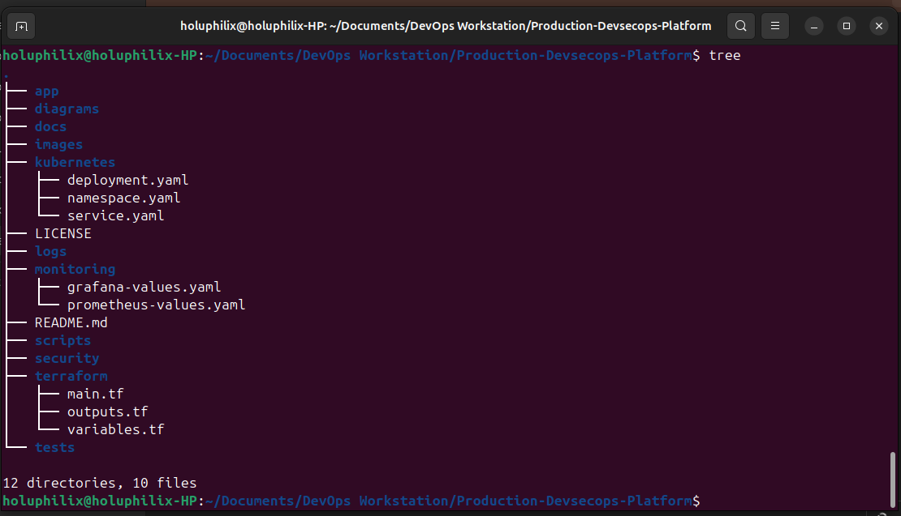

### 🚫 Creating the .gitignore File

Create a `.gitignore` file to prevent unnecessary system files, Terraform state files, logs, cache files, and local environment artifacts from being pushed into the GitHub repository.

Run the following command to create the `.gitignore` file.

```bash
touch .gitignore
```

The `.gitignore` configuration improves repository hygiene, operational consistency, and security posture by preventing unnecessary local artifacts and sensitive operational files from being committed into source control.

### 📝 Configuring the .gitignore File

Run the following command to open the `.gitignore` file.

```bash
nano .gitignore
```

Add the following configuration into the `.gitignore` file.

```gitignore
# =========================
# Terraform Files
# =========================
*.tfstate
*.tfstate.*
.terraform/
crash.log
override.tf
override.tf.json
*_override.tf
*_override.tf.json
.terraform.lock.hcl

# =========================
# Kubernetes Files
# =========================
kubeconfig.yaml

# =========================
# Docker Files
# =========================
*.tar

# =========================
# Logs
# =========================
logs/
*.log

# =========================
# Environment Files
# =========================
.env
.env.*

# =========================
# macOS Files
# =========================
.DS_Store

# =========================
# Linux Files
# =========================
*~

# =========================
# VSCode Files
# =========================
.vscode/

# =========================
# Node.js Files
# =========================
node_modules/

# =========================
# Python Files
# =========================
__pycache__/
*.pyc

# =========================
# Coverage Reports
# =========================
coverage/

# =========================
# Temporary Files
# =========================
tmp/
temp/
```

The `.gitignore` configuration also helps reduce operational risk by preventing accidental exposure of:

- Local secrets
- Terraform state files
- Runtime logs
- Temporary artifacts
- Environment-specific configurations

This aligns with DevSecOps best practices focused on repository security and secure development workflows.

### ✅ Verifying the .gitignore File

Run the following command to verify the `.gitignore` configuration.

```bash
cat .gitignore
```

### 📸 .gitignore Configuration Validation

The output below verifies the successful configuration of the `.gitignore` file for the platform engineering repository.

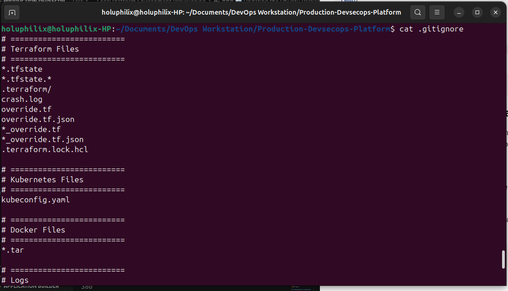

### 🔄 Updating the Ubuntu Package Repository

Update the Ubuntu package index before installing platform tooling.

```bash
sudo apt update
```

Updating the package repository ensures access to the latest package metadata, dependency references, security patches, and package validation information before software installation.

This improves installation reliability and reduces dependency-related installation issues.

### 🐳 Installing Docker Engine

Install Docker Engine within the Ubuntu environment.

```bash
sudo apt install docker.io -y
```

Docker provides the foundational runtime layer required for:

- Application containerization
- Runtime standardization
- Kubernetes workload deployment
- CI/CD container workflows
- Portable software delivery
- Environment consistency

Docker also improves operational scalability by enabling workloads to be deployed consistently across multiple infrastructure environments.

### ▶️ Starting and Enabling Docker

Start and enable the Docker service to ensure persistent runtime availability.

```bash
sudo systemctl enable docker
sudo systemctl start docker
```

Enabling Docker ensures the runtime service automatically initializes during system startup, improving operational reliability and reducing manual service management requirements.

### ✅ Verifying Docker Installation

Run the following command to validate Docker installation and runtime availability.

```bash
docker --version
```

### 📸 Docker Engine Installation Verification

The output below confirms that Docker Engine has been successfully installed and is operational within the Ubuntu platform environment.

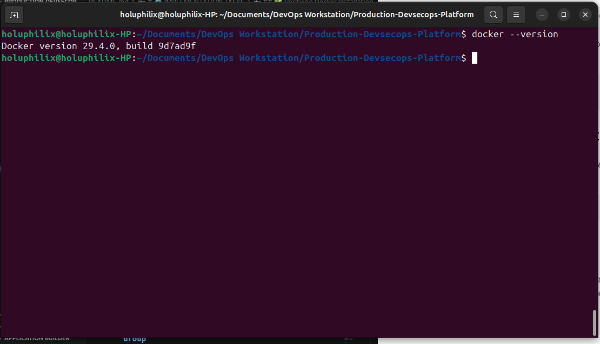

### 👤 Adding the Current User to the Docker Group

Run the following command to allow Docker execution without requiring sudo privileges.

```bash
sudo usermod -aG docker $USER
```

This improves operational usability and streamlines container management workflows by reducing repetitive privilege escalation requirements during container operations.

### 🔄 Applying Docker Group Changes

Run the following command to apply the Docker group changes to the current shell session.

```bash
newgrp docker
```

### 🐳 Verifying Docker Runtime Access

Run the following command to verify non-root Docker access.

```bash
docker ps
```

### 📸 Docker Runtime Access Validation

The output below verifies successful Docker runtime access without elevated sudo privileges.

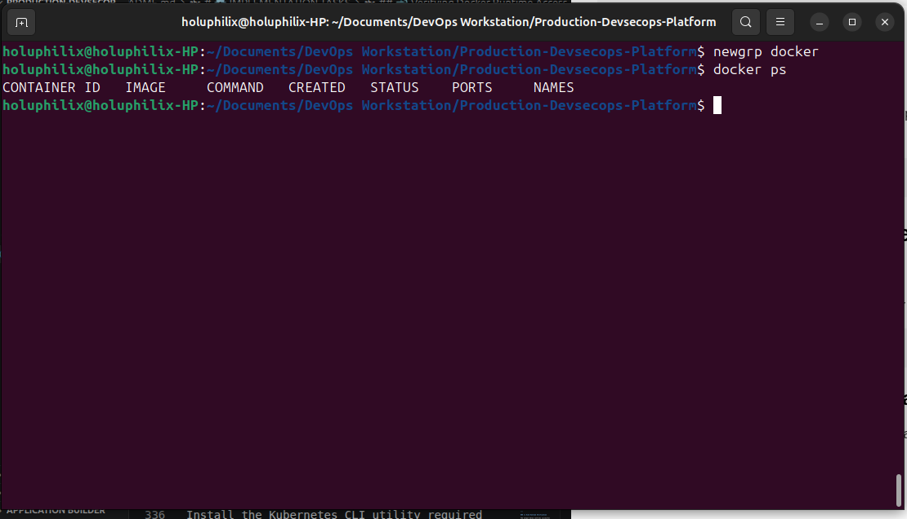

### ☸️ Installing kubectl

Install the Kubernetes CLI utility required for Kubernetes workload management and cluster operations.

```bash
curl -LO "https://dl.k8s.io/release/$(curl -L -s \
https://dl.k8s.io/release/stable.txt)/bin/linux/amd64/kubectl"
```

kubectl serves as the primary operational interface responsible for interacting with the Kubernetes control plane.

Operational capabilities include:

- Workload deployment
- Pod management
- Service inspection
- Deployment troubleshooting
- Namespace management
- Resource validation

### ⚙️ Making kubectl Executable

```bash
chmod +x kubectl
```

### 📦 Moving kubectl into the System Path

```bash
sudo mv kubectl /usr/local/bin/
```

### ✅ Verifying kubectl Installation

Run the following command to validate kubectl installation.

```bash
kubectl version --client
```

### 📸 kubectl Client Verification

The output below confirms successful installation of the Kubernetes command-line client used for Kubernetes cluster management and workload orchestration.

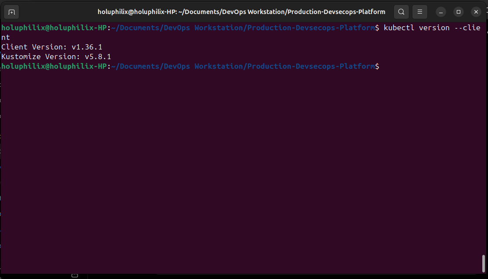

### 🚀 Installing Kind Kubernetes Runtime

Download the Kind Kubernetes runtime used for provisioning the local Kubernetes platform cluster.

```bash
curl -Lo ./kind https://kind.sigs.k8s.io/dl/v0.22.0/kind-linux-amd64
```

Kind was selected because it enables lightweight Kubernetes cluster provisioning locally while still supporting realistic Kubernetes operational workflows.

This improves:

- Local deployment testing
- Kubernetes learning workflows
- CI/CD validation
- Container orchestration testing
- Platform engineering experimentation

without requiring external cloud infrastructure provisioning.

### ⚙️ Making the Kind Binary Executable

```bash
chmod +x ./kind
```

### 📦 Moving the Kind Binary into the System Path

```bash
sudo mv ./kind /usr/local/bin/kind
```

### ✅ Verifying Kind Installation

Run the following command to validate Kind installation.

```bash
kind version
```

### 📸 Kind Runtime Verification

The output below confirms successful installation of the Kind Kubernetes runtime environment.

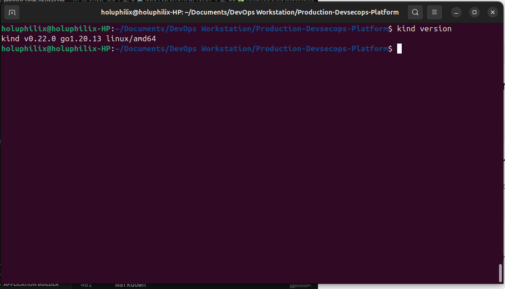

### ☸️ Provisioning the Local Kubernetes Cluster

Create the local Kubernetes cluster using Kind.

```bash
kind create cluster --name devsecops-platform
```

This Kubernetes cluster provides the foundational orchestration environment responsible for:

- Container scheduling
- Replica orchestration
- Kubernetes service exposure
- Deployment validation
- Platform workload operations
- Container lifecycle management

The cluster simulates production-style orchestration workflows within the local platform environment.

### 🔍 Verifying Kubernetes Cluster Availability

Run the following command to validate cluster accessibility and operational readiness.

```bash
kubectl cluster-info --context kind-devsecops-platform
```

Cluster validation ensures the Kubernetes control plane is operational and capable of accepting workload deployments and orchestration requests.

### 📸 Kubernetes Cluster Provisioning Validation

The output below confirms successful provisioning and accessibility of the local Kubernetes platform cluster.

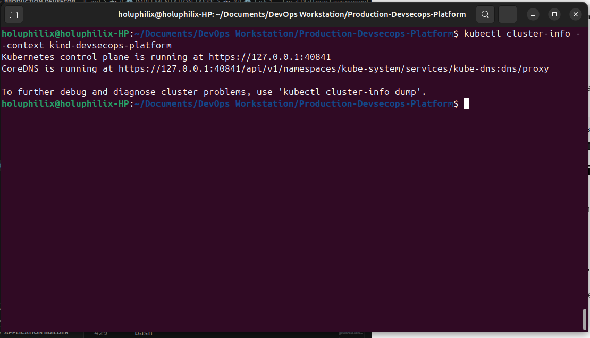

### 🖥️ Validating Kubernetes Cluster Nodes

Run the following command to verify Kubernetes node availability.

```bash
kubectl get nodes
```

This validation confirms successful node registration within the Kubernetes orchestration environment.

### 📸 Kubernetes Cluster Node Validation

The output below verifies that the Kubernetes control-plane node is successfully provisioned and operating within the local platform environment.

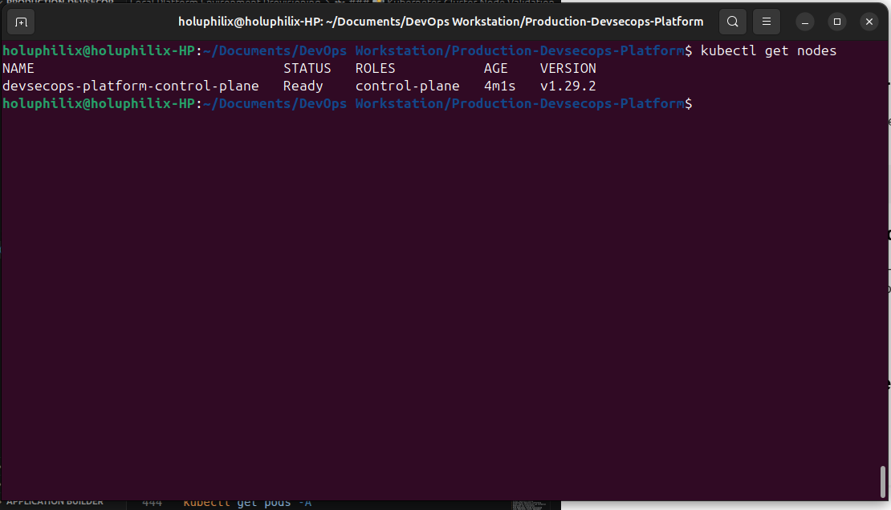

### 📦 Validating Running Kubernetes System Pods

Run the following command to verify that Kubernetes system workloads are operational.

```bash
kubectl get pods -A
```

This validation confirms that Kubernetes system services responsible for orchestration, networking, scheduling, and cluster operations are functioning correctly.

### 📸 Kubernetes System Workload Validation

The output below confirms that Kubernetes system components are successfully running within the Kind cluster environment.

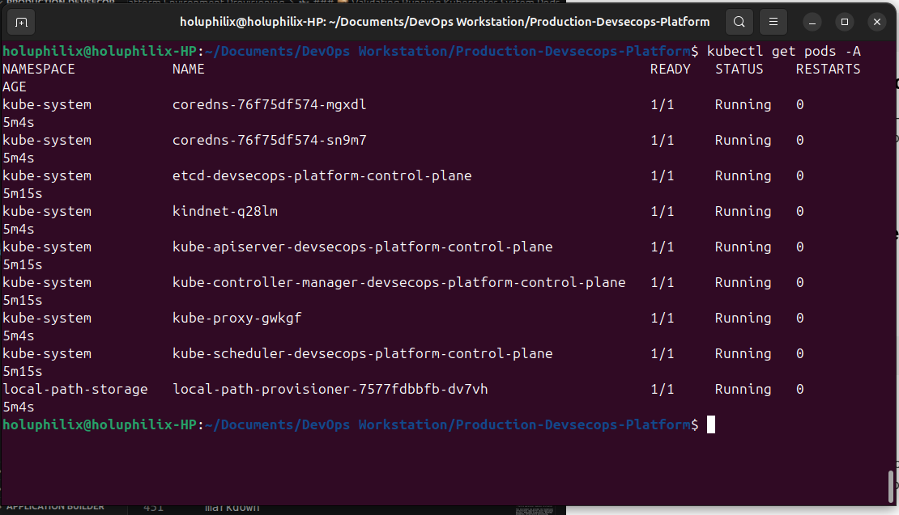

### 📘 Task 1 Summary

In this task, the foundational cloud-native platform engineering environment was successfully provisioned within the Ubuntu local development environment.

The completed setup included:

- GitHub repository cloning
- Standardized repository scaffolding
- Docker Engine installation and validation
- Kubernetes CLI installation
- Kind Kubernetes runtime provisioning
- Local Kubernetes cluster deployment
- Kubernetes node validation
- Platform operational readiness verification

The environment now provides the foundational operational infrastructure required for:

- Secure software delivery
- Kubernetes workload orchestration
- CI/CD automation
- Infrastructure provisioning
- Platform observability
- DevSecOps security integration
- Deployment standardization
- Containerized workload management

This foundational setup establishes the baseline cloud-native operational platform that will support subsequent deployment automation, security enforcement, observability integration, runtime orchestration, and infrastructure lifecycle management throughout the remaining project implementation phases.

## 🧩 Task 2 — Building the Platform Sample Application

### 🎯 Objective

The objective of this task is to build the foundational sample application that will operate as the primary workload throughout the platform engineering lifecycle.

This application will serve as the core workload used for:

- Containerization workflows
- Kubernetes workload orchestration
- CI/CD automation
- DevSecOps security validation
- Infrastructure deployment testing
- Platform observability integration
- Runtime monitoring
- Operational validation

The implementation focuses on establishing a lightweight Node.js application capable of supporting secure cloud-native deployment workflows within the platform environment.

The application is intentionally designed as a platform workload rather than a standalone software project. Its primary purpose is to support deployment automation, Kubernetes orchestration, CI/CD integration, runtime validation, observability workflows, and secure software delivery operations throughout the platform engineering ecosystem.

### 🏗️ Architecture Overview

The application architecture follows a lightweight service-oriented structure designed to support cloud-native operational workflows.

The architecture includes:

- Node.js runtime environment
- Express web application framework
- REST-based HTTP endpoints
- Health validation endpoint
- Platform operational response handling

This lightweight design improves:

- Deployment portability
- Runtime simplicity
- Kubernetes deployment compatibility
- Containerization efficiency
- CI/CD integration simplicity
- Operational testing workflows

The application also provides a standardized workload that will later support:

- Docker containerization
- Kubernetes deployment orchestration
- Health monitoring
- Runtime validation
- Vulnerability scanning
- CI/CD pipeline automation
- Platform observability integration

### ⚙️ Engineering Decisions

Several engineering decisions were made during the application implementation phase to support platform reliability, deployment consistency, operational simplicity, and cloud-native integration workflows.

#### Why Node.js Was Selected

Node.js was selected because it provides a lightweight, event-driven runtime environment capable of supporting cloud-native application workflows efficiently.

Operational benefits include:

- Lightweight runtime footprint
- Fast application startup
- Simplified dependency management
- Strong container compatibility
- Efficient API service development
- Broad cloud-native ecosystem support

The lightweight nature of Node.js makes it highly suitable for containerized environments and Kubernetes-based workload orchestration.

#### Why Express Was Selected

Express was selected to simplify HTTP service implementation while maintaining operational flexibility.

Operational advantages include:

- Lightweight web framework design
- Minimal runtime overhead
- Simplified route management
- Efficient API endpoint handling
- Cloud-native deployment compatibility

Express also integrates efficiently with containerized runtime environments and Kubernetes service exposure workflows.

#### Why a Health Endpoint Was Implemented

The `/health` endpoint was intentionally implemented to support operational health validation workflows.

This endpoint will later support:

- Kubernetes readiness validation
- Monitoring integrations
- Health-check automation
- Observability workflows
- Runtime monitoring
- Platform uptime validation

Health endpoints are commonly used in production Kubernetes environments to validate workload availability and service operational health.

### 📂 Navigating into the Application Directory

Run the following command to move into the application directory.

```bash
cd app
```

### ⚙️ Initializing the Node.js Application

Run the following command to initialize the Node.js application.

```bash
npm init -y
```

This initialization process creates the foundational Node.js package configuration responsible for dependency management, runtime scripting, application metadata, and operational package tracking.

### 📸 Node.js Application Initialization Validation

The output below confirms successful initialization of the Node.js application package configuration.

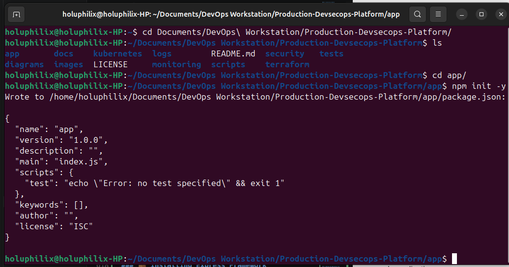

### 📦 Installing Express Framework

Install the Express framework required for building the platform sample application.

```bash
npm install express
```

Express provides the lightweight web framework layer responsible for handling application routing, HTTP responses, service endpoints, and platform API operations.

### 📸 Express Framework Installation Validation

The output below confirms successful installation of the Express framework dependency.

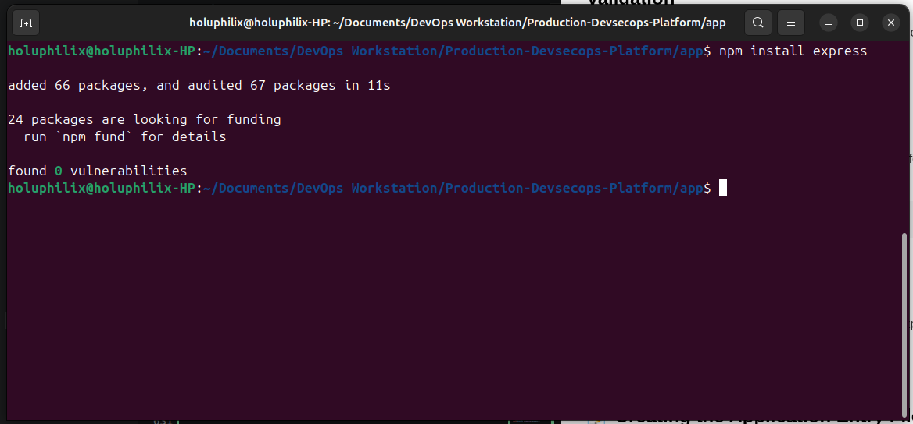

### 📝 Creating the Application Entry File

Run the following command to create the primary application entry file.

```bash
touch app.js
```

The `app.js` file serves as the primary runtime entry point responsible for application initialization, route management, runtime execution, and service exposure.

### 📝 Opening the Application File

Run the following command to open the application file.

```bash
nano app.js
```

Add the following application configuration into the `app.js` file.

```javascript
const express = require('express');

const app = express();

const PORT = 3000;

app.get('/', (req, res) => {
    res.send('Production-Grade DevSecOps CI/CD Platform');
});

app.get('/health', (req, res) => {
    res.status(200).json({
        status: 'healthy',
        platform: 'Production-Grade DevSecOps CI/CD Platform',
        environment: 'local'
    });
});

app.listen(PORT, () => {
    console.log(`Platform application running on port ${PORT}`);
});
```

The application configuration exposes:

- A root endpoint for platform response validation
- A dedicated health endpoint for operational monitoring workflows
- A standardized runtime port configuration

The implementation intentionally keeps the workload lightweight to simplify containerization, Kubernetes orchestration, CI/CD integration, and platform observability workflows throughout subsequent implementation phases.

### 📸 Application Source Code Validation

The image below verifies successful creation of the Node.js platform application source code.

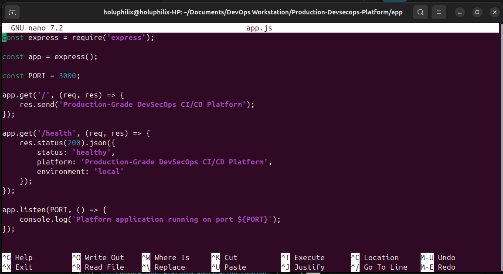

### ⚙️ Updating the package.json Start Script

Run the following command to open the `package.json` file.

```bash
nano package.json
```

Replace the existing scripts section with the following configuration.

```json
{
  "name": "production-devsecops-platform",
  "version": "1.0.0",
  "description": "Production Grade DevSecOps CI/CD Platform",
  "main": "app.js",
  "scripts": {
    "start": "node app.js"
  },
  "dependencies": {
    "express": "^4.19.2"
  }
}
```

The `start` script standardizes application runtime execution across:

- Local development environments
- Docker containers
- CI/CD workflows
- Kubernetes runtime environments

This improves deployment consistency and operational reproducibility throughout the software delivery lifecycle.

### 📸 package.json Configuration Validation

The output below confirms successful configuration of the application runtime script.

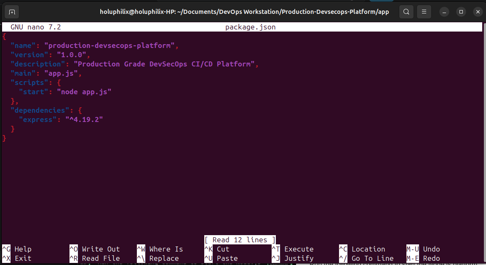

### 🚀 Starting the Platform Application

Run the following command to start the Node.js platform application.

```bash
npm start
```

This launches the application runtime environment and exposes the service on port `3000` for local operational validation.

### 📸 Local Application Runtime Validation

The output below confirms that the platform sample application is successfully running within the Ubuntu local environment.

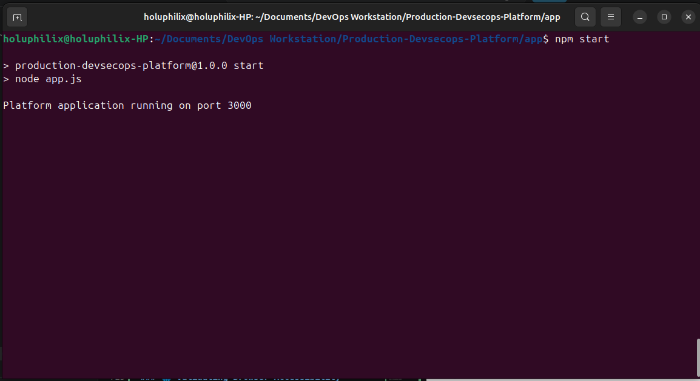

### 🌐 Validating Browser Accessibility

Open the following URL within the browser.

```text
http://localhost:3000
```

Browser validation confirms successful HTTP service exposure and application accessibility within the local runtime environment.

### 📸 Browser Application Accessibility Validation

The image below verifies successful browser accessibility of the platform sample application.

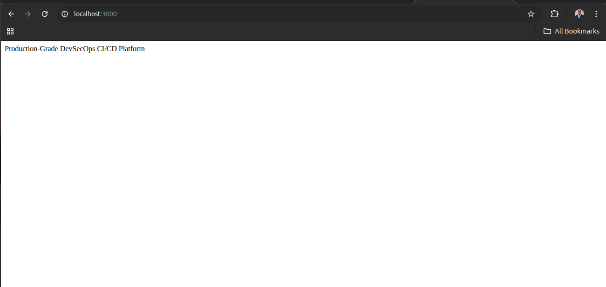

### ❤️ Validating the Health Endpoint

Open the following URL within the browser.

```text
http://localhost:3000/health
```

The health endpoint validates operational service availability and confirms that the application runtime is functioning correctly.

This endpoint will later support:

- Kubernetes health probes
- Monitoring integrations
- Uptime validation
- Observability workflows
- Runtime health monitoring

### 📸 Health Endpoint Validation

The output below confirms successful operation of the platform health validation endpoint.

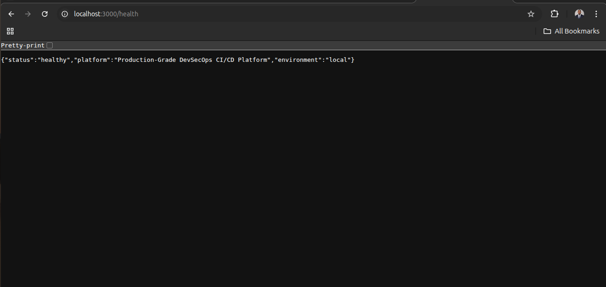

### 🧪 Verifying the Application Directory Structure

Run the following command to validate the updated application directory structure.

```bash
tree
```

This validation confirms successful creation of application runtime files, dependency packages, and operational configuration resources.

### 📸 Application Directory Structure Validation

The output below verifies successful creation of the Node.js application files, dependency packages, and runtime configuration.

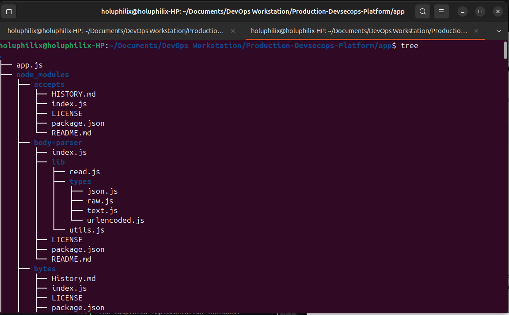

### 🔍 Operational Considerations

Several operational considerations were incorporated during this implementation phase to support production-style deployment workflows.

#### Runtime Port Standardization

The application uses a dedicated runtime port (`3000`) to simplify:

- Container exposure
- Kubernetes service mapping
- Health validation
- Local runtime consistency

#### Lightweight Runtime Design

The lightweight application structure improves:

- Faster container builds
- Reduced runtime overhead
- Simplified orchestration
- Improved deployment portability

#### Future Kubernetes Compatibility

The application design intentionally supports future Kubernetes integration including:

- Health probes
- Service exposure
- Replica orchestration
- Containerized deployment workflows

### 🔐 Security Considerations

Although the application is intentionally lightweight, several secure development considerations were included.

These include:

- Controlled dependency installation
- Minimal application surface area
- Dedicated health validation endpoint
- Simplified runtime exposure
- Reduced operational complexity

Future tasks will expand the security posture through:

- Vulnerability scanning
- Static application security testing
- Container security validation
- Secret detection workflows
- Secure CI/CD enforcement

### 📘 Task 2 Summary

In this task, the foundational platform sample application was successfully developed and validated within the Ubuntu local environment.

The completed implementation included:

- Node.js application initialization
- Express framework installation
- Platform application source code creation
- Runtime configuration setup
- Application startup validation
- Browser accessibility testing
- Health endpoint implementation
- Application structure verification

The implemented application now serves as the foundational workload responsible for supporting:

- Containerization workflows
- Kubernetes orchestration
- CI/CD automation
- Runtime validation
- Platform observability
- Health monitoring
- Security scanning workflows
- Deployment automation

This implementation establishes the primary cloud-native workload that will progress throughout the remaining DevSecOps platform engineering lifecycle.

## 🐳 Task 3 — Containerization and Runtime Standardization

### 🎯 Objective

The objective of this task is to containerize the platform sample application using Docker in order to establish standardized runtime environments across the platform engineering ecosystem.

Containerization enables:

- Consistent application runtime behavior
- Environment reproducibility
- Kubernetes deployment readiness
- Platform portability
- Scalable workload orchestration
- Standardized cloud-native deployments
- Runtime isolation and dependency consistency

This implementation establishes the foundational container runtime layer required for Kubernetes orchestration, CI/CD automation, DevSecOps security scanning, and platform deployment workflows throughout the remaining project phases.

The containerization layer is intentionally designed to improve operational consistency across development, CI/CD, Kubernetes orchestration, and future production deployment environments.

### 🏗️ Architecture Overview

The platform runtime architecture now evolves from a local application runtime into a standardized containerized workload environment.

The container architecture consists of:

- Docker runtime engine
- Lightweight Node.js container image
- Standardized runtime dependencies
- Isolated application execution environment
- Container networking and port exposure
- Portable deployment packaging

This architecture improves:

- Deployment portability
- Runtime consistency
- Environment reproducibility
- Kubernetes deployment readiness
- CI/CD integration compatibility
- Operational scalability

The containerized workload will later support:

- Kubernetes orchestration
- Vulnerability scanning
- Container registry integration
- CI/CD deployment automation
- Runtime monitoring
- Platform observability workflows

### ⚙️ Engineering Decisions

Several engineering decisions were made during the containerization phase to support operational reliability, deployment consistency, portability, and cloud-native runtime standardization.

#### Why Docker Was Selected

Docker was selected because it provides a standardized runtime environment capable of packaging application dependencies, runtime configurations, and operational behavior into isolated portable containers.

Operational advantages include:

- Consistent runtime behavior
- Simplified deployment workflows
- Dependency isolation
- Infrastructure portability
- Kubernetes compatibility
- CI/CD integration support

Without containerization, workloads may behave differently across environments due to runtime inconsistencies, dependency mismatches, and operating system variations.

Docker solves these operational challenges by standardizing the application runtime environment across local systems, CI/CD pipelines, Kubernetes clusters, and future infrastructure environments.

#### Why Containerization Matters for Kubernetes

Kubernetes orchestrates containers rather than traditional applications directly.

Containerization provides:

- Portable workloads
- Standardized runtime packaging
- Simplified orchestration
- Replica consistency
- Infrastructure portability
- Predictable deployment behavior

This containerization layer is therefore essential for enabling reliable Kubernetes deployment workflows throughout the platform ecosystem.

#### Why the Alpine Image Was Selected

The `node:20-alpine` base image was selected because it provides a lightweight runtime environment optimized for reduced container size and improved operational efficiency.

Operational benefits include:

- Smaller image size
- Faster image downloads
- Reduced attack surface
- Faster container startup
- Improved deployment efficiency

Lightweight images are commonly preferred within cloud-native environments to improve scalability and deployment performance.

### 📂 Navigating into the Application Directory

Run the following command to move into the application directory.

```bash
cd app
```

### 📝 Creating the Dockerfile

Run the following command to create the Dockerfile.

```bash
touch Dockerfile
```

The Dockerfile serves as the infrastructure blueprint responsible for defining the container runtime environment, dependency installation workflow, runtime configuration, and application startup behavior.

### 📝 Opening the Dockerfile

Run the following command to open the Dockerfile.

```bash
nano Dockerfile
```

Add the following Docker configuration into the `Dockerfile`.

```dockerfile
FROM node:20-alpine

WORKDIR /app

COPY package*.json ./

RUN npm install

COPY . .

EXPOSE 3000

CMD ["npm", "start"]
```

This Docker configuration establishes:

- A lightweight Node.js runtime environment
- Standardized application working directory
- Dependency installation workflow
- Runtime port exposure
- Automated application startup behavior

The configuration intentionally follows a simplified production-style container workflow optimized for portability, runtime consistency, and Kubernetes compatibility.

### 📸 Dockerfile Configuration Validation

The image below verifies successful creation of the Dockerfile used for containerizing the platform application.

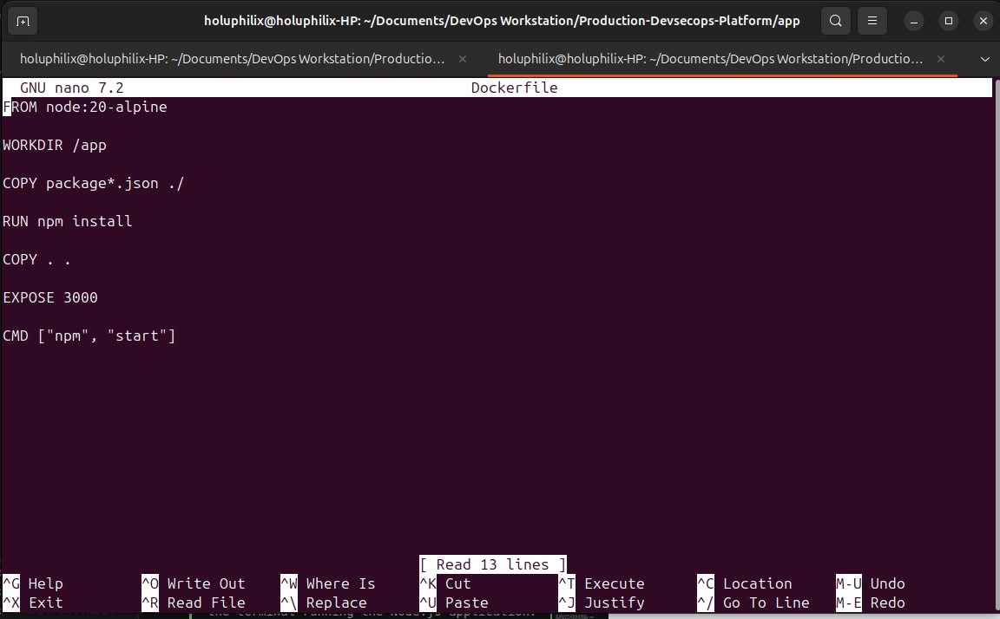

### 🔐 Security Considerations

Several security considerations were incorporated into the containerization workflow.

#### Lightweight Runtime Image

The Alpine-based image reduces unnecessary packages and minimizes the container attack surface.

This improves:

- Runtime efficiency
- Security posture
- Reduced vulnerability exposure
- Operational performance

#### Dependency Isolation

Application dependencies are isolated inside the container runtime environment rather than relying on host-level dependencies.

This improves:

- Runtime consistency
- Dependency management
- Operational reproducibility
- Environment isolation

#### Future Vulnerability Scanning Readiness

The container image architecture prepares the platform for future DevSecOps integration workflows including:

- Trivy vulnerability scanning
- Container security validation
- CI/CD security enforcement
- Dependency analysis
- Runtime security inspection

### 🛑 Stopping the Local Node.js Runtime

Before building the container image, stop the currently running local Node.js application.

Press the following keyboard shortcut inside the terminal running the Node.js application.

```text
CTRL + C
```

Stopping the local runtime prevents port conflicts and ensures the containerized application can successfully bind to the designated runtime port.

### 🏗️ Building the Docker Container Image

Run the following command to build the Docker container image.

```bash
docker build -t production-devsecops-platform:v1 .
```

The image build process packages:

- Application source code
- Runtime dependencies
- Node.js runtime environment
- Startup configuration
- Container execution instructions

into a portable runtime artifact capable of executing consistently across infrastructure environments.

The image tag (`v1`) introduces workload versioning practices commonly used within production deployment workflows.

### 📸 Docker Image Build Validation

The output below confirms successful creation of the Docker container image for the platform application.

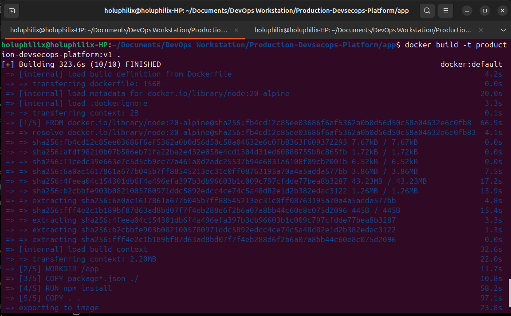

### 📦 Verifying Available Docker Images

Run the following command to verify the newly created Docker image.

```bash
docker images
```

This validation confirms successful image registration within the local Docker runtime environment.

### 📸 Docker Image Verification

The output below confirms successful availability of the platform container image within the Docker runtime environment.

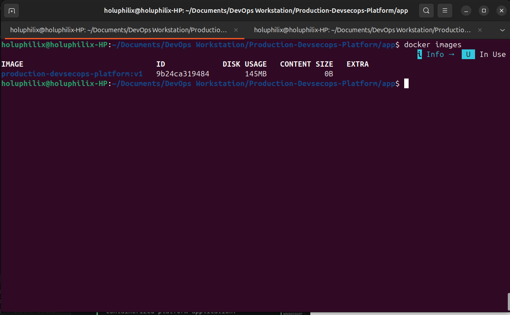

### 🚀 Running the Docker Container

Run the following command to start the containerized platform application.

```bash
docker run -d -p 3000:3000 --name production-devsecops-container production-devsecops-platform:v1
```

This deployment command:

- Launches the containerized workload
- Maps container networking ports
- Enables runtime accessibility
- Standardizes application execution
- Simulates production-style container operations

The `-d` flag enables detached runtime execution, allowing the container to operate independently in the background.

### 📸 Docker Container Runtime Validation

The output below confirms successful startup of the platform container runtime environment.

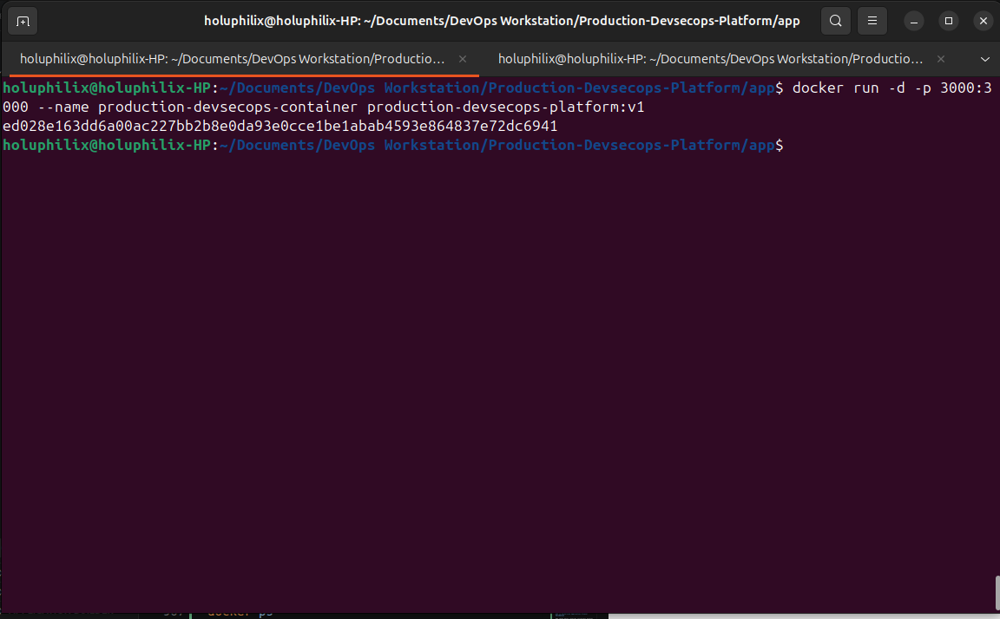

### 📦 Verifying Running Docker Containers

Run the following command to verify active Docker containers.

```bash
docker ps
```

This validation confirms successful workload execution and active container runtime operations.

### 📸 Active Docker Container Validation

The output below verifies that the platform application container is actively running within the Docker runtime environment.

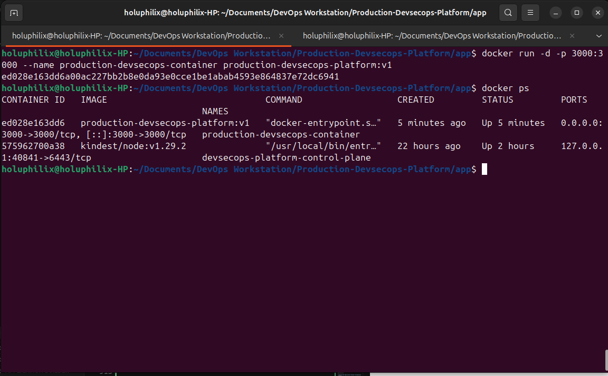

### 🌐 Validating Browser Accessibility Through Docker

Open the following URL within the browser.

```text
http://localhost:3000
```

This validation confirms successful container networking configuration and runtime service exposure.

### 📸 Dockerized Application Browser Validation

The image below confirms successful browser accessibility of the containerized platform application.

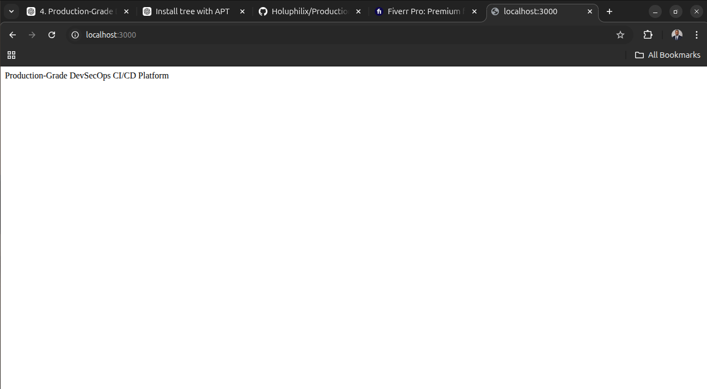

### ❤️ Validating the Dockerized Health Endpoint

Open the following URL within the browser.

```text
http://localhost:3000/health
```

The health endpoint validates operational runtime availability inside the containerized environment.

This endpoint will later support:

- Kubernetes liveness probes
- Readiness validation
- Monitoring integrations
- Runtime health checks
- Observability workflows

### 📸 Dockerized Health Endpoint Validation

The output below confirms successful operation of the containerized platform health validation endpoint.

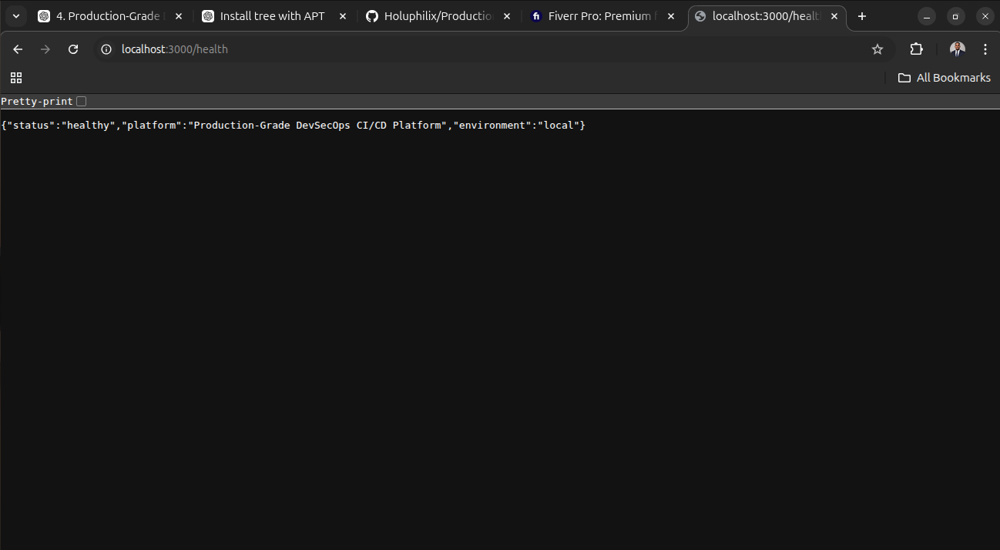

### 📜 Inspecting Docker Container Logs

Run the following command to inspect container runtime logs.

```bash
docker logs production-devsecops-container
```

Container logs provide operational visibility into workload execution, runtime behavior, application startup events, and troubleshooting workflows.

Runtime logging is critical for:

- Incident troubleshooting
- Deployment validation
- Runtime monitoring
- Operational observability
- Failure diagnosis

### 📸 Docker Container Logs Validation

The output below verifies successful runtime logging from the platform container environment.

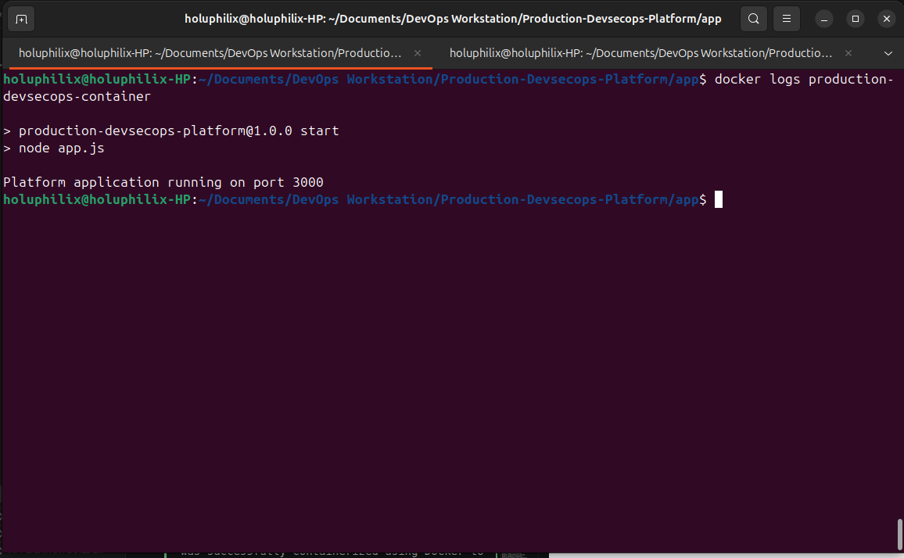

### 📊 Operational Considerations

Several operational considerations were incorporated during the containerization implementation phase.

#### Runtime Standardization

The containerized runtime environment ensures consistent application behavior across:

- Local development
- CI/CD workflows
- Kubernetes deployments
- Future production environments

#### Deployment Portability

The container image can be deployed consistently across multiple environments without modifying application dependencies or runtime configurations.

#### Scalability Readiness

Containerized workloads improve future scalability support through:

- Kubernetes orchestration
- Replica deployments
- Load-balanced service exposure
- Automated scheduling workflows

#### Failure Isolation

Containerization improves workload isolation by separating runtime dependencies from the host operating system.

This reduces infrastructure conflicts and improves operational reliability.

### 📘 Task 3 Summary

In this task, the platform sample application was successfully containerized using Docker to establish a standardized cloud-native runtime environment.

The completed implementation included:

- Dockerfile creation
- Container image configuration
- Docker image build validation
- Container runtime deployment
- Docker image verification
- Browser accessibility testing
- Health endpoint validation
- Container runtime log inspection

The completed containerization workflow now provides the foundational runtime layer required for:

- Kubernetes workload orchestration
- CI/CD automation
- DevSecOps security enforcement
- Vulnerability scanning
- Cloud-native deployment standardization
- Operational scalability
- Runtime portability
- Infrastructure consistency

This implementation establishes the standardized container runtime environment that will support the remaining platform engineering lifecycle including Kubernetes orchestration, CI/CD automation, observability integration, infrastructure security validation, and secure software delivery workflows.

## ☸️ Task 4 — Kubernetes Workload Orchestration

### 🎯 Objective

The objective of this task is to deploy the containerized platform application into the Kubernetes environment provisioned using Kind.

This phase establishes the foundational Kubernetes orchestration layer responsible for:

- Container workload scheduling
- Application scalability
- Kubernetes service exposure
- Cloud-native deployment standardization
- Runtime orchestration
- Platform workload management
- Kubernetes operational validation

The implementation focuses on deploying standardized Kubernetes resources capable of supporting secure cloud-native workload operations throughout the platform engineering lifecycle.

This orchestration layer transforms the platform from a standalone container runtime into a cloud-native operational environment capable of managing scalable workloads, service exposure, replica orchestration, deployment consistency, and infrastructure reliability.

### 🏗️ Architecture Overview

The Kubernetes architecture introduces an orchestration layer responsible for managing containerized workloads inside the cloud-native platform environment.

The orchestration architecture includes:

- Kubernetes Namespace isolation
- Kubernetes Deployment resources
- Replica-based workload management
- Kubernetes Service exposure
- Pod scheduling and orchestration
- Cluster-based runtime management

This architecture improves:

- Workload scalability
- Deployment consistency
- Self-healing operations
- Runtime orchestration
- Infrastructure standardization
- Operational reliability

The Kubernetes orchestration layer now becomes the operational backbone responsible for managing workload lifecycle operations throughout the platform ecosystem.

### ⚙️ Engineering Decisions

Several engineering decisions were made during this orchestration phase to support scalability, operational reliability, deployment consistency, and production-style cloud-native workflows.

#### Why Kubernetes Was Selected

Kubernetes was selected because it is the industry-standard orchestration platform responsible for automating container deployment, workload scheduling, service management, and infrastructure scalability across cloud-native environments.

Operational benefits include:

- Automated workload orchestration
- Replica management
- Service discovery
- Self-healing infrastructure
- Deployment standardization
- Container scheduling
- Infrastructure scalability

Kubernetes improves operational consistency by managing workloads declaratively rather than through manual deployment workflows.

#### Why Namespaces Were Implemented

Namespaces were implemented to logically isolate workloads inside the Kubernetes cluster.

Operational advantages include:

- Resource organization
- Environment isolation
- Workload separation
- Operational manageability
- Simplified resource governance

Namespaces become especially important within production environments containing multiple applications, workloads, or engineering teams.

#### Why Replica-Based Deployments Were Used

The deployment configuration uses multiple replicas to simulate high availability and workload scalability.

This improves:

- Operational reliability
- Workload redundancy
- Traffic distribution
- Fault tolerance
- Self-healing capabilities

If one pod fails, Kubernetes automatically attempts to restore the desired workload state by recreating failed replicas.

#### Why NodePort Was Selected

The `NodePort` service type was selected to expose the Kubernetes workload externally within the local environment.

Operational advantages include:

- Simplified local accessibility
- Service exposure testing
- Kubernetes networking validation
- Browser-based workload verification

This service exposure mechanism allows the workload to be accessed outside the Kubernetes cluster.

### 📂 Navigating into the Kubernetes Directory

Run the following command to move into the Kubernetes configuration directory.

```bash
cd ../kubernetes
```

The Kubernetes directory serves as the centralized orchestration configuration layer responsible for managing deployment manifests, service definitions, namespace configurations, and workload orchestration resources.

### 🏷️ Creating the Kubernetes Namespace Configuration

Run the following command to open the namespace configuration file.

```bash
nano namespace.yaml
```

Add the following configuration into the `namespace.yaml` file.

```yaml
apiVersion: v1
kind: Namespace
metadata:
  name: devsecops-platform
```

The namespace configuration provides logical workload isolation inside the Kubernetes cluster environment.

This improves:

- Resource organization
- Operational separation
- Deployment manageability
- Future scalability support

### 📸 Kubernetes Namespace Configuration Validation

The image below verifies successful creation of the Kubernetes namespace configuration.

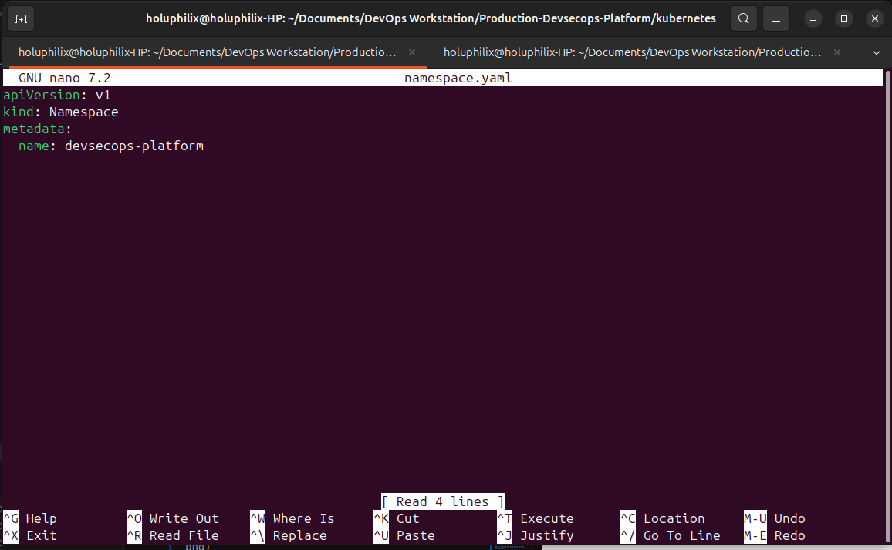

### 🚀 Creating the Kubernetes Deployment Configuration

Run the following command to open the deployment configuration file.

```bash
nano deployment.yaml
```

Add the following configuration into the `deployment.yaml` file.

```yaml
apiVersion: apps/v1
kind: Deployment
metadata:
  name: production-devsecops-deployment
  namespace: devsecops-platform
spec:
  replicas: 2

  selector:
    matchLabels:
      app: production-devsecops-platform

  template:
    metadata:
      labels:
        app: production-devsecops-platform

    spec:
      containers:
      - name: production-devsecops-container

        image: production-devsecops-platform:v1

        imagePullPolicy: Never

        ports:
        - containerPort: 3000
```

This deployment configuration defines the operational workload state that Kubernetes should maintain continuously.

The deployment resource is responsible for:

- Replica orchestration
- Pod scheduling
- Workload recovery
- Runtime lifecycle management
- Deployment consistency

The `replicas: 2` configuration improves workload availability by ensuring multiple pod instances remain operational inside the cluster.

The `imagePullPolicy: Never` configuration is intentionally used because the image exists locally inside the Kind cluster environment rather than inside an external container registry.

### 📸 Kubernetes Deployment Configuration Validation

The image below confirms successful creation of the Kubernetes deployment manifest.

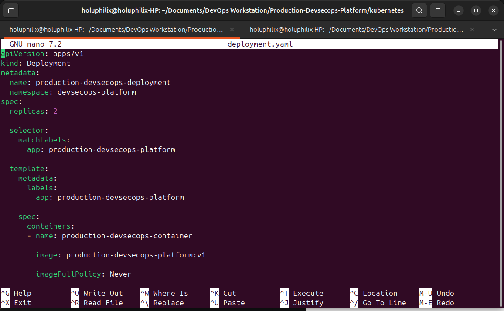

### 🌐 Creating the Kubernetes Service Configuration

Run the following command to open the Kubernetes service configuration file.

```bash
nano service.yaml
```

Add the following configuration into the `service.yaml` file.

```yaml
apiVersion: v1
kind: Service
metadata:
  name: production-devsecops-service
  namespace: devsecops-platform
spec:
  selector:
    app: production-devsecops-platform

  ports:
    - protocol: TCP
      port: 80
      targetPort: 3000

  type: NodePort
```

The Kubernetes service resource provides network abstraction and workload accessibility for the deployed application pods.

Operational responsibilities include:

- Service discovery
- Internal traffic routing
- Workload accessibility
- Pod communication abstraction

Without Kubernetes services, workloads would not have stable network exposure inside the orchestration environment.

### 📸 Kubernetes Service Configuration Validation

The image below verifies successful creation of the Kubernetes service manifest.

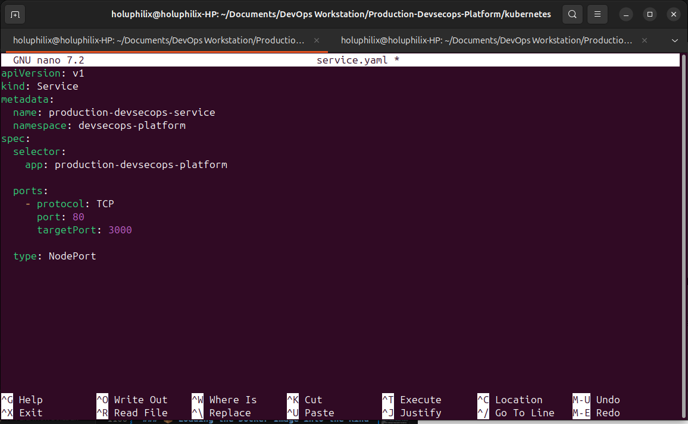

### 📦 Loading the Docker Image into the Kind Cluster

Run the following command to load the locally built Docker image into the Kind Kubernetes cluster.

```bash
kind load docker-image production-devsecops-platform:v1 --name devsecops-platform
```

Because Kind operates inside its own containerized runtime environment, locally built Docker images must be explicitly loaded into the Kubernetes cluster runtime.

This ensures the Kubernetes deployment can access the application image successfully.

### 📸 Kind Docker Image Load Validation

The output below confirms successful loading of the Docker image into the Kubernetes cluster runtime.

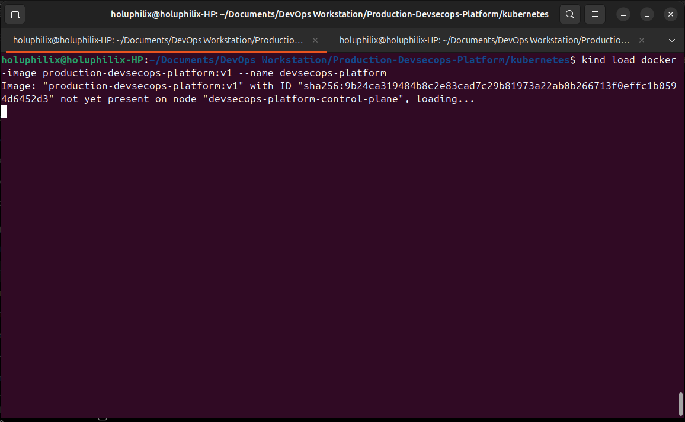

### ☸️ Deploying the Kubernetes Namespace

Run the following command to deploy the namespace resource.

```bash
kubectl apply -f namespace.yaml
```

This command applies the namespace configuration into the Kubernetes orchestration environment.

### 📸 Kubernetes Namespace Deployment Validation

The output below confirms successful deployment of the Kubernetes namespace resource.

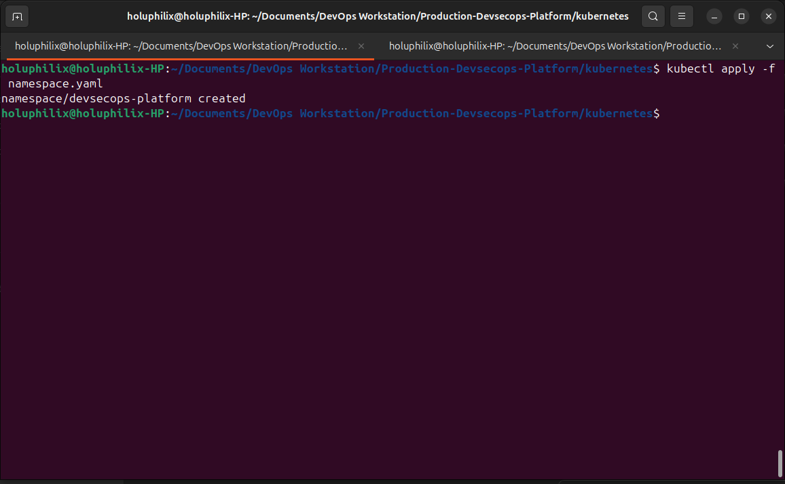

### 🚀 Deploying the Kubernetes Deployment Resource

Run the following command to deploy the workload deployment resource.

```bash
kubectl apply -f deployment.yaml
```

This deployment operation instructs Kubernetes to schedule and maintain the defined workload replicas inside the orchestration environment.

Kubernetes continuously monitors the workload state and attempts to restore failed workloads automatically when disruptions occur.

### 📸 Kubernetes Deployment Resource Validation

The output below confirms successful deployment of the Kubernetes workload deployment resource.

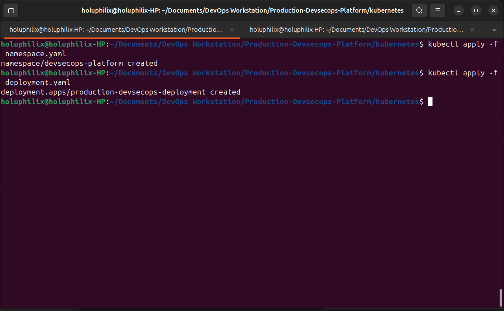

### 🌐 Deploying the Kubernetes Service Resource

Run the following command to deploy the Kubernetes service resource.

```bash
kubectl apply -f service.yaml
```

This operation exposes the workload service and enables network accessibility within the Kubernetes environment.

### 📸 Kubernetes Service Deployment Validation

The output below confirms successful deployment of the Kubernetes service resource.

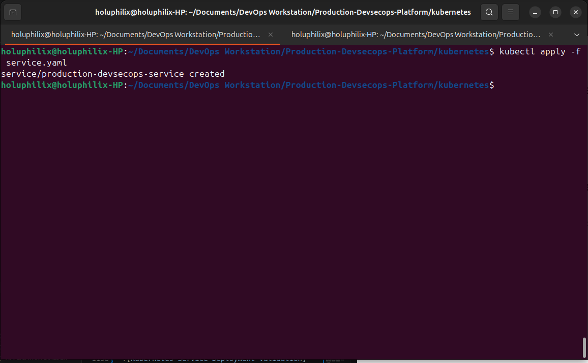

### 📦 Verifying Kubernetes Pods

Run the following command to verify Kubernetes workload pods.

```bash
kubectl get pods -n devsecops-platform
```

Pod validation confirms successful workload scheduling and operational availability inside the Kubernetes orchestration environment.

This verification also confirms that the Kubernetes scheduler successfully deployed and initialized all workload replicas.

### 📸 Kubernetes Pod Validation

The output below verifies successful deployment and operational readiness of the Kubernetes workload pods.

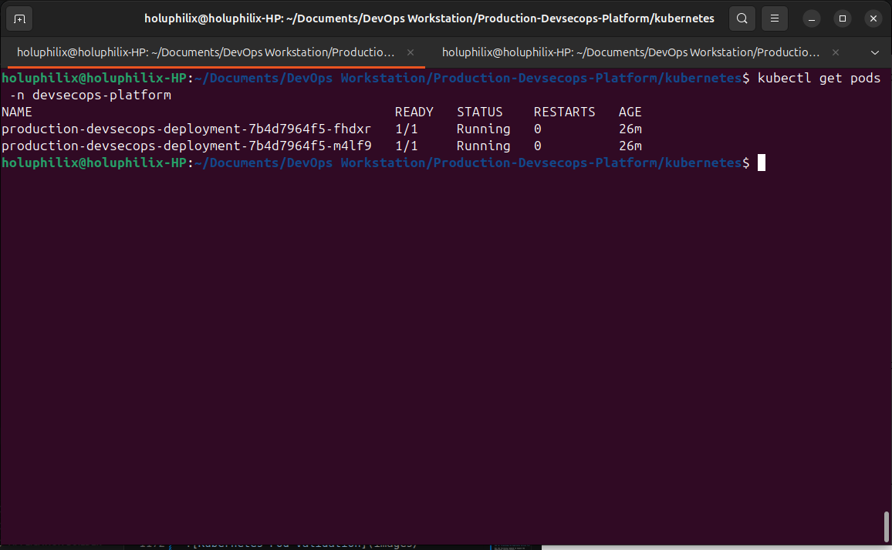

### 🌐 Verifying Kubernetes Services

Run the following command to verify Kubernetes service exposure.

```bash
kubectl get svc -n devsecops-platform
```

This validation confirms successful service creation and workload network exposure inside the Kubernetes cluster.

### 📸 Kubernetes Service Validation

The output below confirms successful exposure of the Kubernetes platform service.

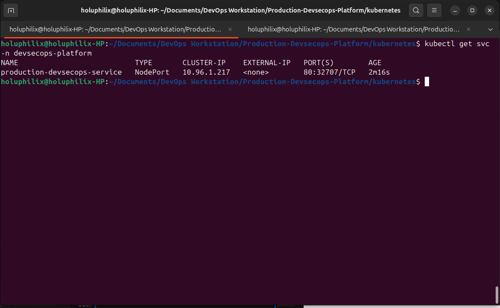

### 🖥️ Forwarding the Kubernetes Service Port

Run the following command to expose the Kubernetes service locally.

```bash
kubectl port-forward svc/production-devsecops-service 3000:80 -n devsecops-platform
```

Port forwarding enables local browser accessibility for operational validation and workload testing.

This simulates external service accessibility while maintaining the Kubernetes orchestration workflow internally.

### 📸 Kubernetes Port Forward Validation

The output below confirms successful local port forwarding for Kubernetes service accessibility.

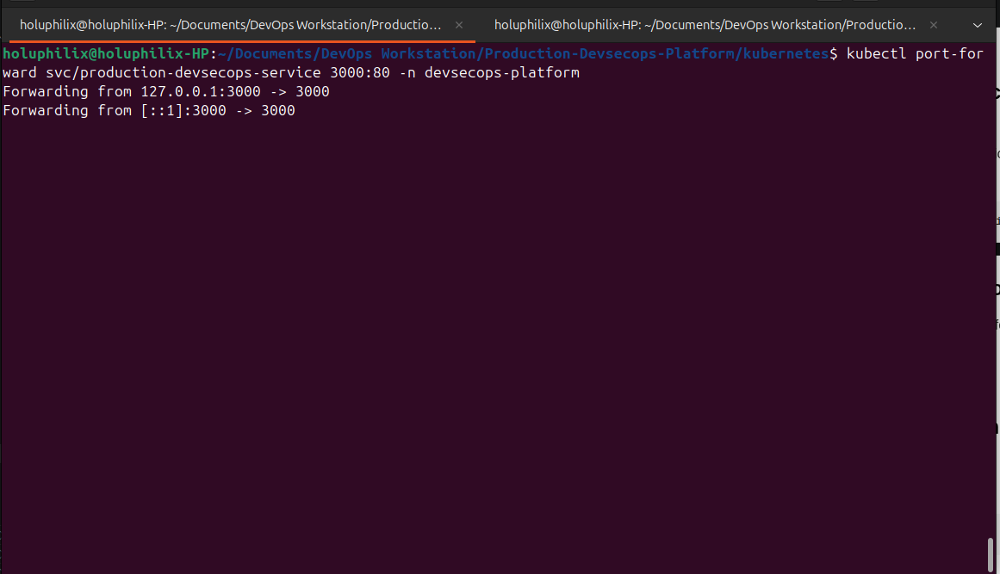

### 🌐 Validating Kubernetes Application Accessibility

Open the following URL within the browser.

```text
http://localhost:3000
```

This validation confirms successful workload exposure through the Kubernetes networking layer.

### 📸 Kubernetes Browser Accessibility Validation

The image below confirms successful browser accessibility of the Kubernetes-deployed platform application.

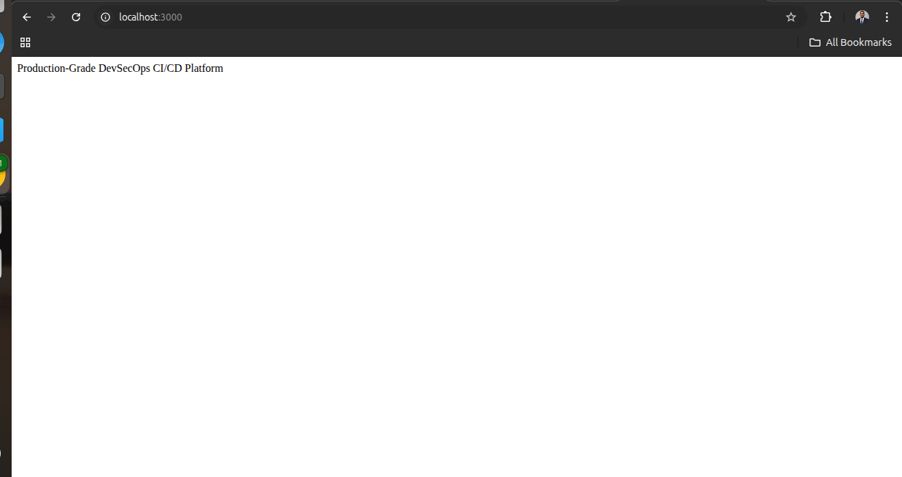

### ❤️ Validating the Kubernetes Health Endpoint

Open the following URL within the browser.

```text
http://localhost:3000/health
```

The health endpoint validates operational workload availability inside the Kubernetes orchestration environment.

This endpoint will later support:

- Kubernetes liveness probes
- Readiness probes
- Monitoring integrations
- Runtime health validation
- Observability workflows

### 📸 Kubernetes Health Endpoint Validation

The output below confirms successful operation of the Kubernetes-deployed platform health endpoint.

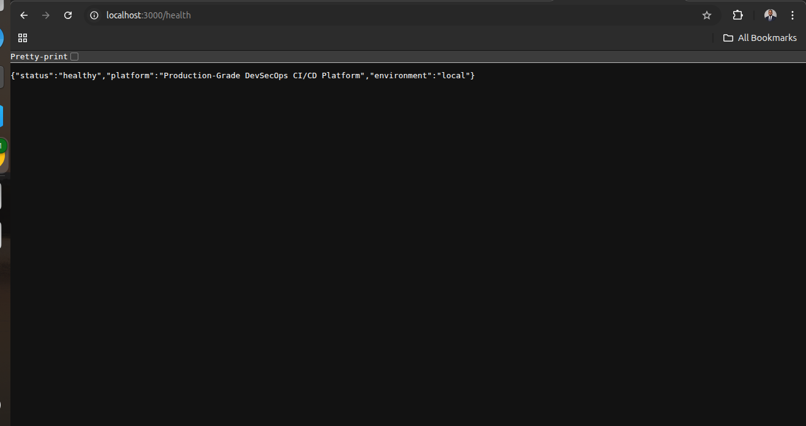

### 📦 Verifying Kubernetes Deployment Resources

Run the following command to validate Kubernetes deployment resources.

```bash
kubectl get deployments -n devsecops-platform
```

This validation confirms successful deployment orchestration, replica availability, and workload operational health.

### 📸 Kubernetes Deployment Resource Verification

The output below confirms successful Kubernetes deployment orchestration and replica availability.

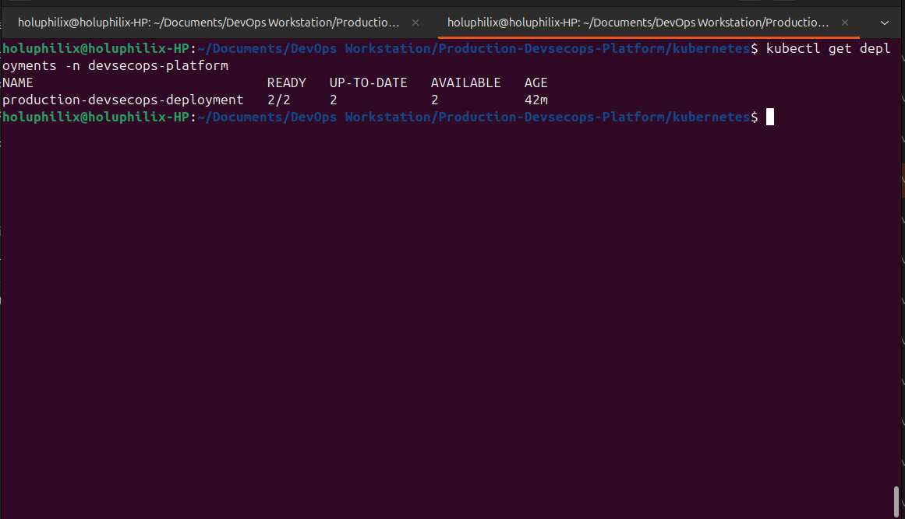

### 📊 Operational Considerations

Several operational considerations were integrated during this Kubernetes orchestration phase.

#### Self-Healing Infrastructure

Kubernetes continuously monitors workload state and automatically restores failed workloads when disruptions occur.

This improves:

- Infrastructure reliability
- Operational resilience
- Workload recovery
- Platform availability

#### Replica-Based Scalability

Replica orchestration improves workload scalability and operational redundancy by distributing workloads across multiple pod instances.

#### Deployment Standardization

Kubernetes manifests standardize workload deployment behavior across environments, improving operational consistency and infrastructure reproducibility.

#### Service Abstraction

Kubernetes services decouple workloads from direct pod networking, improving workload flexibility and operational manageability.

### 🔐 Security Considerations

Several security-focused considerations were included during the orchestration workflow.

These include:

- Namespace-based workload isolation
- Controlled service exposure
- Containerized runtime separation
- Declarative infrastructure management
- Standardized deployment configurations

Future tasks will further enhance platform security through:

- Vulnerability scanning
- Infrastructure policy validation
- Secret detection workflows
- Runtime security monitoring
- Secure CI/CD enforcement

### 📘 Task 4 Summary

In this task, the containerized platform application was successfully deployed into the Kubernetes environment provisioned through Kind.

The completed implementation included:

- Kubernetes namespace creation
- Kubernetes deployment configuration
- Kubernetes service configuration
- Docker image integration into Kind
- Kubernetes workload deployment
- Service exposure configuration
- Kubernetes pod validation
- Browser accessibility testing
- Kubernetes health endpoint validation
- Kubernetes deployment verification

The completed orchestration layer now provides the foundational Kubernetes operational environment responsible for:

- Workload scheduling
- Replica orchestration
- Cloud-native deployment management
- Runtime scalability
- Service exposure
- Infrastructure standardization
- Deployment consistency
- Platform operational reliability

This implementation establishes the core Kubernetes orchestration layer that will support CI/CD automation, DevSecOps security integration, observability monitoring, scalable workload management, and cloud-native operational workflows throughout the remaining platform engineering lifecycle.

## ⚙️ Task 5 — CI/CD Platform Automation

### 🎯 Objective

The objective of this task is to implement an automated CI/CD workflow using GitHub Actions in order to standardize secure software delivery across the platform engineering environment.

This phase establishes the foundational CI/CD automation layer responsible for:

- Automated workflow execution
- Continuous integration validation
- Docker image automation
- Kubernetes deployment automation
- Workflow standardization
- Platform deployment consistency
- Operational automation

The implementation focuses on establishing a production-oriented CI/CD workflow capable of supporting cloud-native deployment operations throughout the remaining platform engineering lifecycle.

This CI/CD layer transforms the platform from a manually operated deployment environment into an automated delivery ecosystem capable of supporting scalable cloud-native software delivery workflows.

### 🏗️ Architecture Overview

The CI/CD architecture introduces an automated workflow orchestration layer responsible for validating, building, and standardizing software delivery operations.

The automation architecture includes:

- GitHub-hosted source control integration
- GitHub Actions workflow automation
- Automated container image builds
- Kubernetes configuration validation
- Workflow execution pipelines
- Event-driven deployment triggers

This architecture improves:

- Deployment consistency
- Operational automation
- Infrastructure reliability
- Release standardization
- Validation enforcement
- Delivery efficiency

The CI/CD layer now becomes a core operational component responsible for orchestrating deployment workflows throughout the platform ecosystem.

### ⚙️ Engineering Decisions

Several engineering decisions were made during the CI/CD implementation phase to support operational reliability, deployment consistency, scalability, and secure software delivery workflows.

#### Why GitHub Actions Was Selected

GitHub Actions was selected because it provides native CI/CD automation capabilities directly integrated into the GitHub ecosystem.

Operational advantages include:

- Native repository integration
- Event-driven automation
- Simplified workflow orchestration
- Automated validation pipelines
- Cloud-native workflow support
- Infrastructure automation compatibility

GitHub Actions also simplifies operational workflow management by centralizing source control and automation pipelines within a single engineering platform.

#### Why CI/CD Automation Is Important

Manual deployment workflows introduce operational risks including:

- Human error
- Deployment inconsistency
- Missed validation steps
- Operational delays
- Unreliable release processes

CI/CD automation improves:

- Release reliability
- Deployment consistency
- Validation standardization
- Infrastructure reproducibility
- Operational efficiency

Automation ensures every deployment follows the same validated workflow process.

#### Why Workflow Validation Stages Were Included

The workflow intentionally validates:

- Repository accessibility
- Docker runtime availability
- Container image build capability
- Kubernetes configuration availability

These validations establish the foundational operational checks required before introducing more advanced DevSecOps security enforcement workflows later in the platform lifecycle.

### 📂 Navigating into the GitHub Workflows Directory

Run the following command to move into the GitHub Actions workflows directory.

```bash
cd ../.github/workflows
```

The `.github/workflows` directory serves as the centralized automation layer responsible for defining CI/CD execution workflows, operational validation pipelines, and deployment automation processes.

### 📝 Creating the GitHub Actions Workflow File

Run the following command to create the CI/CD workflow configuration file.

```bash
touch ci-cd.yaml
```

The workflow configuration file defines the automated pipeline responsible for orchestrating platform delivery operations.

### 📝 Opening the Workflow Configuration File

Run the following command to open the workflow configuration file.

```bash
nano ci-cd.yaml
```

Add the following configuration into the `ci-cd.yaml` file.

```yaml
name: Production DevSecOps CI/CD Pipeline

on:
  push:
    branches:
      - main

jobs:

  platform-ci-cd-workflow:

    runs-on: ubuntu-latest

    steps:

      - name: Checkout Repository
        uses: actions/checkout@v4

      - name: Verify Repository Structure
        run: ls -la

      - name: Verify Docker Installation
        run: docker --version

      - name: Build Docker Image
        run: |
          cd app
          docker build -t production-devsecops-platform:v1 .

      - name: Validate Kubernetes Configuration Files
        run: |
          ls kubernetes

      - name: CI/CD Pipeline Validation
        run: echo "Production DevSecOps CI/CD Pipeline executed successfully"
```

This workflow establishes the foundational CI/CD automation lifecycle responsible for:

- Source code checkout
- Repository validation
- Docker runtime validation
- Automated container image builds
- Kubernetes configuration inspection
- Workflow execution validation

The workflow is intentionally designed as a foundational automation pipeline that will later evolve into a more advanced DevSecOps delivery system integrating:

- Security scanning
- Vulnerability detection
- Secret management
- Infrastructure validation
- Deployment automation
- Observability integrations

### 📸 GitHub Actions Workflow Configuration Validation

The image below verifies successful creation of the GitHub Actions CI/CD workflow configuration.

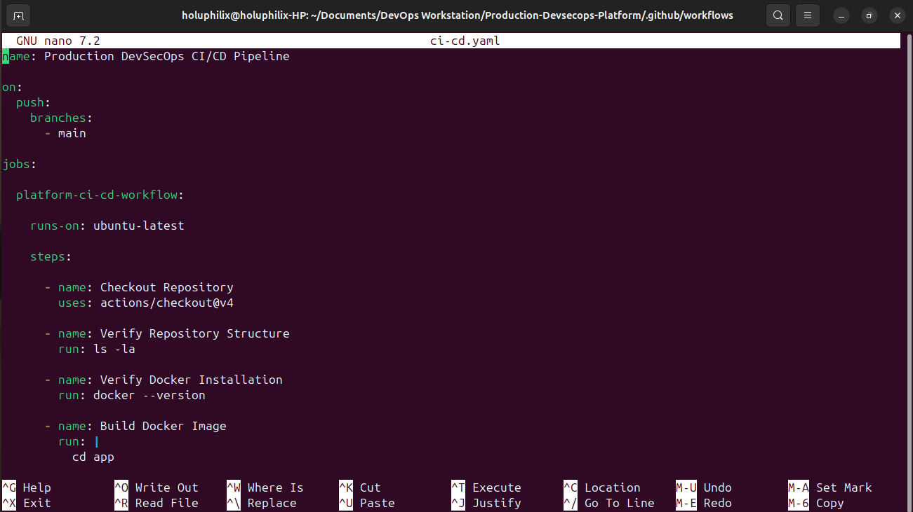

### 🔐 Security Considerations

Several security-focused considerations were incorporated into the CI/CD workflow design.

#### Automated Validation Pipelines

Automation reduces the risk of inconsistent deployment practices and improves operational reliability by enforcing standardized workflow execution.

#### Controlled Pipeline Execution

The workflow triggers only when code changes are pushed into the `main` branch.

This improves:

- Deployment governance
- Workflow predictability
- Release standardization

#### Foundation for Future DevSecOps Integration

The pipeline architecture prepares the platform for future integration of:

- Trivy vulnerability scanning
- SonarQube SAST analysis
- Gitleaks secret detection
- Checkov infrastructure scanning
- Secure deployment enforcement

The CI/CD pipeline will later evolve into a fully integrated DevSecOps automation ecosystem.

### 📂 Returning to the Project Root Directory

Run the following command to return to the project root directory.

```bash
cd ../../
```

### 📦 Verifying the GitHub Actions Workflow Structure

Run the following command to validate the GitHub workflow file location.

```bash
tree .github
```

This validation confirms correct placement of the CI/CD automation configuration inside the GitHub Actions operational directory structure.

### 📸 GitHub Workflow Structure Validation

The output below confirms successful placement of the CI/CD workflow within the GitHub Actions workflow directory.

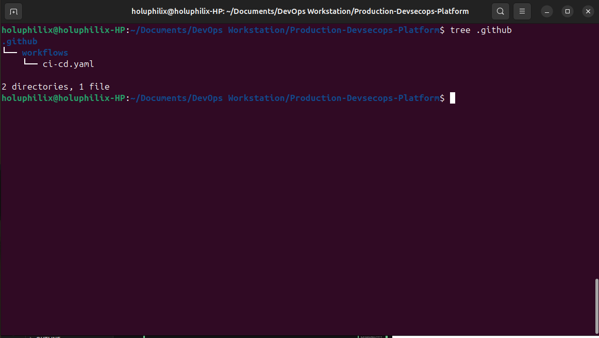

### 🚀 Triggering the GitHub Actions Workflow

Run the following commands to push the CI/CD workflow into GitHub and automatically trigger pipeline execution.

```bash
git add .

git commit -m "TASK 5: CI/CD platform automation implemented"

git push origin main
```

The push operation automatically activates the CI/CD workflow because the pipeline is configured to respond to repository changes pushed into the `main` branch.

This demonstrates event-driven deployment automation commonly used within production cloud-native delivery environments.

### 🌐 Opening the GitHub Actions Dashboard

Open the GitHub repository within the browser and navigate to:

```text
GitHub Repository → Actions Tab
```

The GitHub Actions dashboard provides centralized operational visibility into:

- Workflow execution
- Pipeline history
- Validation stages
- Build status
- Deployment operations
- CI/CD troubleshooting

This operational visibility improves workflow monitoring and deployment observability across the engineering platform.

### 📸 GitHub Actions Pipeline Execution Validation

The image below confirms successful execution of the GitHub Actions CI/CD workflow pipeline.

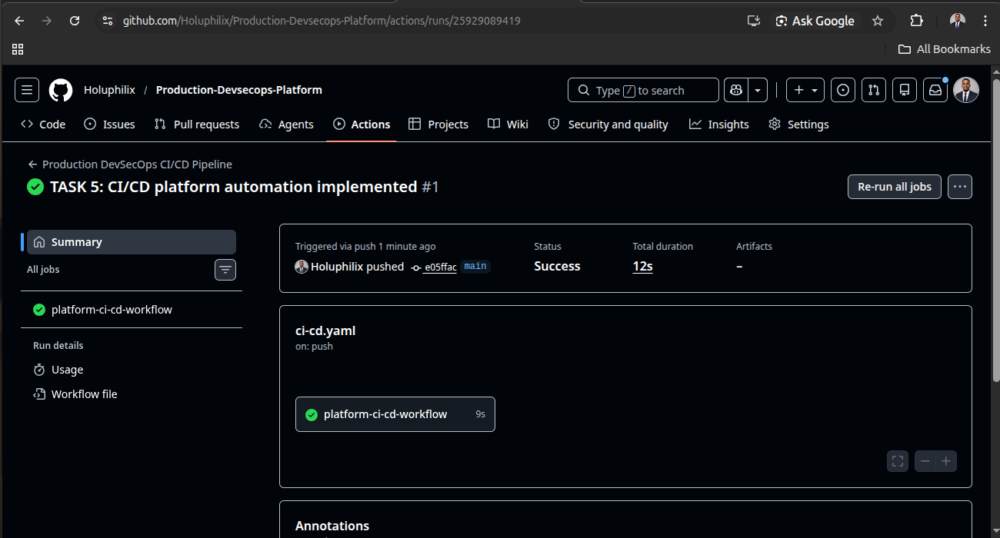

### 🔍 Inspecting Workflow Job Execution

Open the executed workflow job to validate all CI/CD stages.

Verify successful execution of:

- Repository checkout
- Docker validation
- Docker image build
- Kubernetes configuration validation
- CI/CD pipeline validation

Each pipeline stage contributes toward standardized delivery validation and operational consistency within the platform ecosystem.

### 📸 GitHub Actions Job Validation

The image below verifies successful execution of all CI/CD workflow stages.

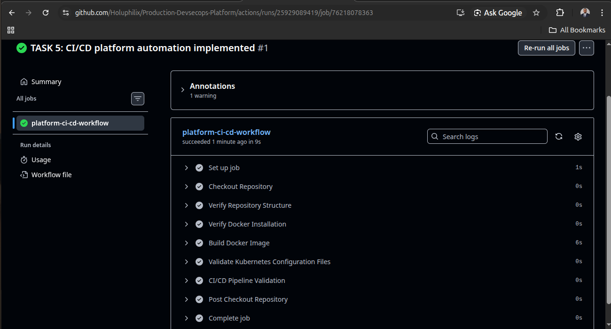

### 📊 Operational Considerations

Several operational considerations were incorporated during the CI/CD implementation phase.

#### Event-Driven Automation

The pipeline automatically executes when repository changes occur, eliminating the need for manual deployment validation workflows.

#### Standardized Delivery Workflows

Every workflow execution follows the same validation sequence, improving deployment consistency and operational reliability.

#### Infrastructure Validation Readiness

The pipeline architecture is intentionally structured to support future integration of:

- Infrastructure validation
- Security enforcement
- Automated deployment workflows
- Runtime verification
- Compliance validation

#### Failure Visibility

GitHub Actions provides centralized pipeline visibility, making deployment failures easier to identify, inspect, and troubleshoot.

This improves operational responsiveness and deployment reliability.

### 📈 Observability Considerations

Although observability tooling has not yet been integrated, GitHub Actions already provides foundational operational visibility through:

- Pipeline execution logs
- Workflow history
- Build status tracking
- Job execution monitoring
- Failure diagnostics

Future platform phases will extend observability capabilities through:

- Prometheus metrics collection
- Grafana dashboards
- Operational telemetry
- Infrastructure monitoring
- Alert integrations

### 📘 Task 5 Summary

In this task, the foundational CI/CD automation layer was successfully implemented using GitHub Actions.

The completed implementation included:

- GitHub Actions workflow creation
- Automated repository validation
- Docker runtime validation
- Automated container image build workflow
- Kubernetes configuration validation
- CI/CD workflow automation
- GitHub Actions pipeline execution validation
- Workflow job execution verification

The completed CI/CD automation layer now provides the foundational operational workflow responsible for:

- Automated software delivery
- Deployment validation
- Release standardization
- Workflow orchestration
- Container build automation
- Infrastructure validation readiness
- Operational consistency
- Platform deployment automation

This implementation establishes the foundational CI/CD automation ecosystem that will support DevSecOps security enforcement, Kubernetes deployment standardization, observability integration, secure software delivery workflows, and production-oriented cloud-native operational automation throughout the remaining platform engineering lifecycle.

## 🔐 Task 6 — DevSecOps Security Enforcement Integration

### 🎯 Objective

The objective of this task is to integrate automated DevSecOps security validation workflows into the CI/CD platform in order to improve software delivery security, infrastructure protection, and deployment reliability.

This phase establishes the foundational DevSecOps security enforcement layer responsible for:

- Automated secret detection
- Container vulnerability scanning
- Infrastructure security validation
- Secure CI/CD enforcement
- Deployment risk reduction
- Security visibility integration
- Continuous security validation

The implementation focuses on integrating automated security controls directly into the CI/CD delivery lifecycle to ensure vulnerabilities, exposed credentials, insecure infrastructure configurations, and container security risks are identified before workload deployment.

This implementation transforms the CI/CD platform from a traditional automation workflow into a security-aware DevSecOps delivery ecosystem capable of supporting production-oriented secure software delivery operations.

### 🏗️ Architecture Overview

The DevSecOps architecture introduces an automated security enforcement layer integrated directly into the CI/CD workflow pipeline.

The security architecture includes:

- Gitleaks secret detection
- Trivy container vulnerability scanning
- Checkov infrastructure security validation
- GitHub Actions security automation
- Continuous validation workflows
- Automated security enforcement

This architecture improves:

- Deployment security
- Vulnerability visibility
- Secret exposure prevention
- Infrastructure protection
- CI/CD hardening
- Operational risk reduction

The DevSecOps layer now becomes an integrated operational security system responsible for continuously validating workloads, infrastructure configurations, and deployment workflows throughout the platform lifecycle.

### ⚙️ Engineering Decisions

Several engineering decisions were made during this implementation phase to support secure software delivery, operational protection, infrastructure security, and automated vulnerability validation workflows.

#### Why DevSecOps Integration Was Introduced

Traditional CI/CD pipelines often prioritize deployment speed while overlooking continuous security validation.

This creates operational risks including:

- Vulnerable workload deployments
- Credential exposure
- Infrastructure misconfigurations
- Delayed vulnerability detection
- Increased attack surface exposure

DevSecOps integration improves software delivery security by embedding automated security validation directly into the deployment lifecycle.

This enables security enforcement to occur continuously throughout the CI/CD workflow rather than after deployment.

#### Why Gitleaks Was Selected

Gitleaks was selected to provide automated secret detection capabilities within the source code repository.

Operational benefits include:

- Credential leak prevention
- API key exposure detection
- Token validation
- Repository security enforcement
- CI/CD security validation

Exposed credentials are among the most common cloud-native security risks.

Automated secret scanning significantly improves repository security posture.

#### Why Trivy Was Selected

Trivy was selected because it provides lightweight and efficient container vulnerability scanning capabilities.

Operational advantages include:

- Container vulnerability detection
- Dependency security analysis
- Operating system package scanning
- CI/CD integration compatibility
- Fast vulnerability validation

Container vulnerability scanning improves visibility into insecure runtime dependencies before workloads are deployed into Kubernetes environments.

#### Why Checkov Was Selected

Checkov was selected to validate Infrastructure-as-Code security configurations.

Operational benefits include:

- Infrastructure policy validation
- Terraform security scanning
- Misconfiguration detection
- Compliance visibility
- Infrastructure security enforcement

Infrastructure misconfigurations are a major source of cloud security incidents.

Automated infrastructure scanning improves infrastructure reliability and security posture.

### 📂 Navigating into the GitHub Workflows Directory

Run the following command to move into the GitHub Actions workflow directory.

```bash
cd .github/workflows
```

### 📝 Opening the Existing CI/CD Workflow File

Run the following command to open the existing CI/CD workflow configuration.

```bash
nano ci-cd.yaml
```

### 🛡️ Updating the CI/CD Workflow with DevSecOps Security Enforcement

Replace the existing workflow configuration with the following updated DevSecOps pipeline configuration.

```yaml
name: Production DevSecOps CI/CD Pipeline

on:
  push:
    branches:
      - main

jobs:

  devsecops-platform-pipeline:

    runs-on: ubuntu-latest

    steps:

      - name: Checkout Repository
        uses: actions/checkout@v4

      - name: Verify Repository Structure
        run: ls -la

      - name: Run Gitleaks Secret Scan
        uses: gitleaks/gitleaks-action@v2

      - name: Verify Docker Installation
        run: docker --version

      - name: Build Docker Image
        run: |
          cd app
          docker build -t production-devsecops-platform:v1 .

      - name: Run Trivy Container Security Scan
        uses: aquasecurity/trivy-action@master
        with:
          image-ref: 'production-devsecops-platform:v1'
          format: 'table'
          exit-code: '0'

      - name: Run Checkov Infrastructure Security Scan
        uses: bridgecrewio/checkov-action@master
        with:
          directory: terraform

      - name: Validate Kubernetes Configuration Files
        run: |
          ls kubernetes

      - name: DevSecOps Pipeline Validation
        run: echo "Production DevSecOps security pipeline executed successfully"
```

This workflow integrates multiple security validation stages directly into the CI/CD delivery lifecycle.

The updated pipeline now performs:

- Repository validation
- Secret detection
- Docker image validation
- Container vulnerability scanning
- Infrastructure security validation
- Kubernetes configuration verification
- DevSecOps pipeline enforcement

This architecture improves deployment security and operational visibility throughout the platform delivery workflow.

### 📸 DevSecOps Pipeline Configuration Validation

The image below verifies successful integration of the DevSecOps security enforcement workflow within the GitHub Actions CI/CD pipeline.

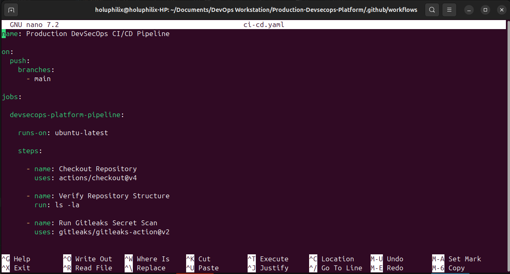
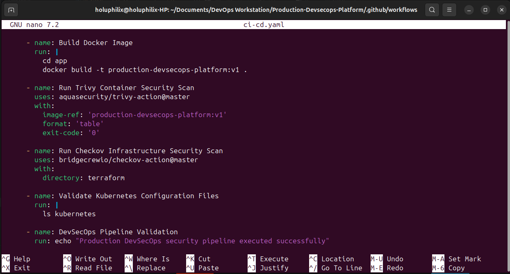

### 🔐 Security Workflow Breakdown

The implemented DevSecOps pipeline now includes multiple automated security enforcement stages.

#### 🔍 Gitleaks Secret Detection

This stage scans the repository for:

- Exposed API keys
- Hardcoded credentials
- Access tokens
- Cloud secrets
- Authentication artifacts

This improves repository security posture and reduces credential exposure risk.

#### 🚨 Trivy Container Vulnerability Scanning

This stage scans the Docker image for:

- Vulnerable packages
- Insecure dependencies
- Operating system vulnerabilities
- Container runtime security issues

This improves workload security visibility before deployment into Kubernetes environments.

#### 🛡️ Checkov Infrastructure Security Validation

This stage scans Infrastructure-as-Code configurations for:

- Misconfigured infrastructure
- Insecure Terraform configurations
- Compliance violations
- Infrastructure policy violations

This improves infrastructure reliability and deployment security consistency.

### 📂 Returning to the Project Root Directory

Run the following command to return to the project root directory.

```bash
cd ../../
```

### 🚀 Triggering the DevSecOps Security Pipeline

Run the following commands to commit and push the updated DevSecOps pipeline configuration.

```bash
git add .

git commit -m "TASK 6: DevSecOps security enforcement integrated"

git push origin main
```

The push operation automatically triggers the updated GitHub Actions DevSecOps workflow pipeline.

This demonstrates event-driven automated security validation within the software delivery lifecycle.

### 🌐 Opening the GitHub Actions Security Pipeline Dashboard

Open the GitHub repository within the browser and navigate to:

```text
GitHub Repository → Actions Tab
```

Open the latest pipeline execution workflow to inspect the integrated DevSecOps security stages.

### 📸 DevSecOps Pipeline Execution Validation

The image below confirms successful execution of the DevSecOps security enforcement pipeline.

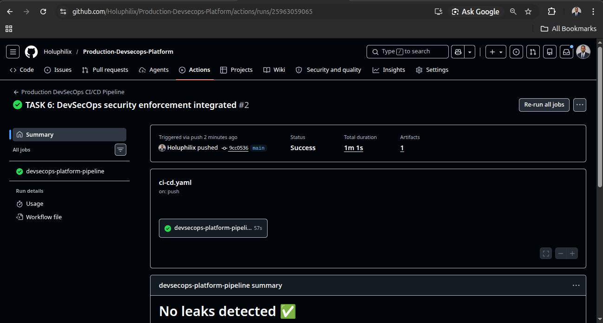

### 🔍 Inspecting Security Workflow Execution Stages

Verify successful execution of the following security validation stages:

- Repository checkout
- Gitleaks secret scanning
- Docker image build
- Trivy vulnerability scanning
- Checkov infrastructure scanning
- Kubernetes configuration validation
- Pipeline completion validation

Each validation stage contributes toward continuous security enforcement across the cloud-native platform environment.

### 📸 Security Workflow Stage Validation

The image below verifies successful execution of all integrated DevSecOps security validation stages.

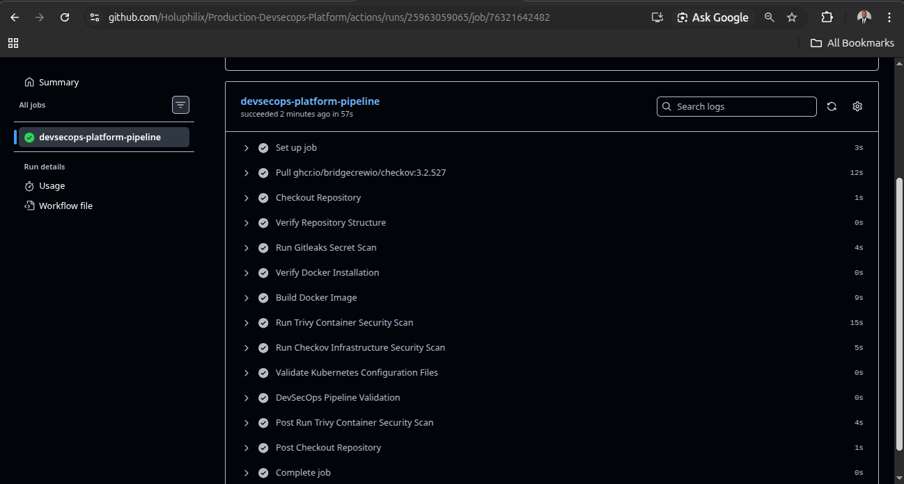

### 📊 Operational Considerations

Several operational considerations were incorporated during the DevSecOps integration phase.

#### Continuous Security Enforcement

Security validation now occurs automatically during every CI/CD pipeline execution.

This improves:

- Vulnerability visibility
- Deployment protection
- Security consistency
- Operational reliability

#### Early Vulnerability Detection

Automated scanning identifies issues earlier within the delivery lifecycle before workloads are deployed into runtime environments.

This reduces remediation complexity and deployment risk.

#### Security Visibility

The CI/CD pipeline now provides centralized visibility into:

- Security validation results
- Vulnerability findings
- Infrastructure risks
- Secret exposure detection

This improves operational awareness across the platform environment.

#### Production-Oriented Security Automation

Embedding security controls directly into deployment workflows aligns with modern DevSecOps operational practices commonly used within production cloud-native engineering environments.

### 📈 Observability Considerations

Although full monitoring integration has not yet been implemented, the DevSecOps workflow already improves operational visibility through:

- Pipeline execution logs
- Security scan outputs
- Vulnerability reporting
- Infrastructure validation results
- Workflow execution history

Future observability integrations will expand visibility through:

- Prometheus monitoring
- Grafana dashboards
- Alert integrations
- Runtime telemetry
- Operational metrics

### 🔄 Failure Handling Considerations

Several operational failure scenarios were considered during the security integration phase.

Potential failure scenarios include:

- Secret detection failures
- Vulnerable container dependencies
- Infrastructure policy violations
- Workflow execution errors
- Misconfigured deployment artifacts

The automated security pipeline improves incident detection by identifying these issues before workloads progress deeper into the deployment lifecycle.

This improves operational reliability and reduces deployment risk exposure.

### 📘 Task 6 Summary

In this task, the foundational DevSecOps security enforcement layer was successfully integrated into the CI/CD platform workflow.

The completed implementation included:

- Gitleaks secret detection integration
- Trivy container vulnerability scanning
- Checkov infrastructure security validation
- GitHub Actions DevSecOps automation
- Continuous security validation workflows
- Automated deployment security enforcement
- Pipeline security visibility integration
- DevSecOps workflow execution validation

The completed DevSecOps layer now provides the foundational security enforcement system responsible for:

- Continuous vulnerability validation
- Secure software delivery
- Repository protection
- Infrastructure security enforcement
- Container security visibility
- Automated security orchestration
- Deployment risk reduction
- CI/CD security hardening

This implementation establishes the integrated DevSecOps security architecture that will support future observability integration, runtime monitoring, infrastructure automation, operational alerting, and production-oriented cloud-native security operations throughout the remaining platform engineering lifecycle.